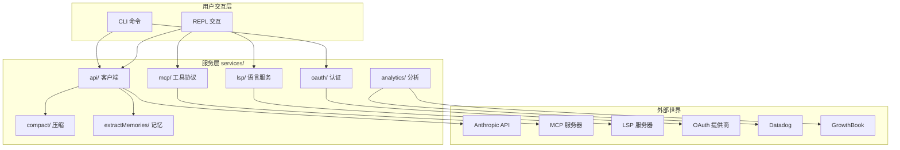

# 图解 Claude Code 完全指南 - 细纲

## 文件信息
- **原文件**: 01-services-overview.md
- **类型**: 第 1 课：服务层概览 —— Claude Code 的外部集成架构
- **难度**: ★★☆☆☆

---

## 一、文档结构概览

### 1.1 学习目标
1. 理解 Claude Code CLI 中 `services/` 目录的整体定位和作用
2. 掌握服务层各子模块（API、MCP、LSP、OAuth、Compact、Analytics）的职责划分
3. 了解服务层如何连接"内核"与"外部世界"
4. 学会用分层思维审视一个大型 TypeScript 项目

### 1.2 章节结构
| 章节 | 主题 | 核心内容 |
|------|------|---------|
| 一、什么是"服务层"？ | 概念入门 | 快递站比喻 |
| 二、源码目录全景图 | 全局视图 | services/ 目录结构 |
| 三、服务层的六大核心模块 | 逐个讲解 | API/MCP/LSP/OAuth/Compact/Analytics |
| 四、模块间的协作关系 | 关系图 | 模块依赖关系 |
| 五、请求的完整生命周期 | 流程图 | 从用户输入到结果返回 |

---

## 二、关键知识点

### 2.1 服务层定位
```
services/ 目录 = 快递站
- 不直接"思考"代码问题
- 负责与外部世界通信
```

### 2.2 六大核心模块职责
| 职责 | 子目录 | 类比 |
|------|--------|------|
| 调用 Anthropic API | `api/` | 寄出包裹（发送请求） |
| 连接外部工具 | `mcp/` | 对接不同快递公司 |
| 获取代码智能 | `lsp/` | 专业质检服务 |
| 用户身份验证 | `oauth/` | 快递实名制验证 |
| 对话压缩 | `compact/` | 包裹瘦身打包 |
| 数据统计 | `analytics/` | 快递追踪系统 |
| 记忆提取 | `extractMemories/` | 重要信件归档 |
| 会话记忆 | `SessionMemory/` | 订单备忘录 |

### 2.3 源码目录结构
```
claude-code-cli-master/
├── services/              ← 本课程的主角
│   ├── api/               ← API 客户端、错误处理、重试
│   ├── mcp/               ← Model Context Protocol 集成
│   ├── lsp/               ← Language Server Protocol 集成
│   ├── oauth/             ← OAuth 2.0 认证流程
│   ├── compact/           ← 上下文压缩算法
│   ├── analytics/         ← 遥测与特性标志
│   ├── extractMemories/   ← 自动记忆提取
│   ├── SessionMemory/     ← 会话记忆管理
│   ├── plugins/           ← 插件系统
│   ├── autoDream/         ← 自动梦境(后台整理)
│   ├── tools/             ← 工具执行服务
│   └── ...
├── tools/                 ← 具体工具实现（Read、Write、Bash...）
├── commands/              ← CLI 命令处理
├── context/               ← 上下文管理
└── utils/                 ← 通用工具函数
```

### 2.4 API 客户端核心代码
```typescript
// services/api/client.ts — 客户端工厂函数
export async function getAnthropicClient({
  apiKey,
  maxRetries,
  model,
  fetchOverride,
  source,
}: {
  apiKey?: string
  maxRetries: number
  model?: string
  fetchOverride?: ClientOptions['fetch']
  source?: string
}): Promise<Anthropic> {
  // 支持多种提供商：Direct API、AWS Bedrock、Vertex AI、Foundry
  // ...
}
```

### 2.5 MCP 传输类型
```typescript
// services/mcp/types.ts — MCP 支持的传输类型
export const TransportSchema = lazySchema(() =>
  z.enum(['stdio', 'sse', 'sse-ide', 'http', 'ws', 'sdk']),
)
```

### 2.6 LSP 客户端接口
```typescript
// services/lsp/LSPClient.ts — LSP 客户端接口
export type LSPClient = {
  readonly capabilities: ServerCapabilities | undefined
  start: (command: string, args: string[]) => Promise<void>
  initialize: (params: InitializeParams) => Promise<InitializeResult>
  sendRequest: <TResult>(method: string, params: unknown) => Promise<TResult>
  stop: () => Promise<void>
}
```

### 2.7 OAuth PKCE 安全机制
```typescript
// services/oauth/crypto.ts — PKCE 安全机制
export function generateCodeVerifier(): string {
  return base64URLEncode(randomBytes(32))
}

export function generateCodeChallenge(verifier: string): string {
  const hash = createHash('sha256')
  hash.update(verifier)
  return base64URLEncode(hash.digest())
}
```

### 2.8 事件日志接口
```typescript
// services/analytics/index.ts — 事件日志接口
export function logEvent(
  eventName: string,
  metadata: LogEventMetadata,
): void {
  if (sink === null) {
    eventQueue.push({ eventName, metadata, async: false })
    return
  }
  sink.logEvent(eventName, metadata)
}
```

### 2.9 模块协作关系图


---

## 三、关联文件索引

### 3.1 前置阅读
- part07-state-management 系列 - 状态管理基础

### 3.2 后续课程
- [02-api-client.md](02-api-client.md) - API 客户端封装

### 3.3 核心源码文件
| 文件路径 | 职责 | 说明 |
|---------|------|------|
| `services/api/client.ts` | API 客户端工厂 | 支持 4 种提供商 |
| `services/mcp/types.ts` | MCP 类型定义 | 传输类型、服务器配置 |
| `services/lsp/LSPClient.ts` | LSP 客户端接口 | 代码智能 |
| `services/oauth/crypto.ts` | PKCE 加密 | 安全认证 |
| `services/analytics/index.ts` | 事件日志 | 遥测系统 |
| `services/compact/` | 上下文压缩 | 三层压缩算法 |

---

## 四、源码对应关系

### 4.1 核心函数
| 函数名 | 位置 | 功能 |
|--------|------|------|
| `getAnthropicClient()` | `services/api/client.ts` | 获取 API 客户端 |
| `generateCodeVerifier()` | `services/oauth/crypto.ts` | 生成 PKCE Verifier |
| `generateCodeChallenge()` | `services/oauth/crypto.ts` | 生成 PKCE Challenge |
| `logEvent()` | `services/analytics/index.ts` | 记录事件 |

### 4.2 核心类型
| 名称 | 类型 | 位置 | 说明 |
|------|------|------|------|
| `LSPClient` | interface | `services/lsp/LSPClient.ts` | LSP 客户端接口 |
| `TransportSchema` | schema | `services/mcp/types.ts` | MCP 传输类型 |

---

## 五、本课小结

| 概念 | 解释 |
|------|------|
| services/ 目录 | Claude Code 的服务层，连接内核与外部世界 |
| API 客户端 | 与 Anthropic API 通信，支持 4 种提供商 |
| MCP | Model Context Protocol，连接外部工具 |
| LSP | Language Server Protocol，提供代码智能 |
| OAuth | 用户身份验证，使用 PKCE 安全机制 |
| Compact | 上下文压缩，管理 Token 窗口 |
| Analytics | 遥测与特性标志控制 |

---

*此细纲由 Claude Code 自动生成，用于快速导航和内容概览*
