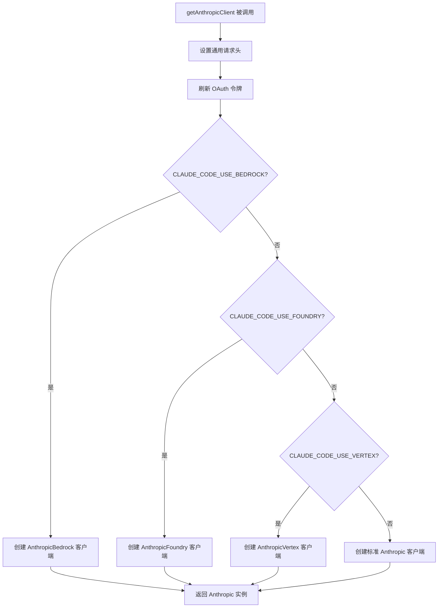
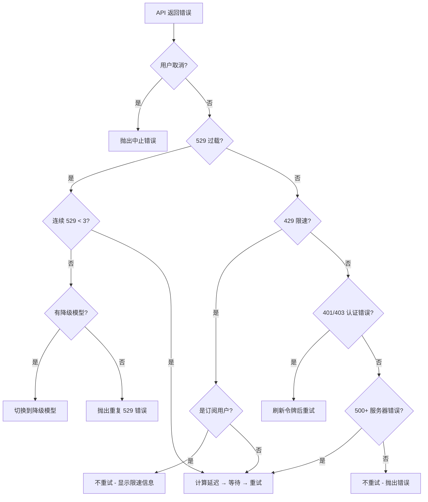

# 图解 Claude Code 完全指南 - 细纲

## 文件信息
- **原文件**: 02-api-client.md
- **类型**: 第 2 课：API 客户端封装 —— 工厂模式与智能重试
- **难度**: ★★★☆☆

---

## 一、文档结构概览

### 1.1 学习目标
1. 理解 `getAnthropicClient()` 工厂函数如何支持 4 种 API 提供商
2. 掌握工厂模式在真实项目中的应用场景
3. 学会 `withRetry()` 的指数退避 + 抖动算法
4. 了解 API 请求的完整生命周期（从发送到重试到降级）

### 1.2 章节结构
| 章节 | 主题 | 核心内容 |
|------|------|---------|
| 一、"万能翻译机"的比喻 | 概念入门 | 工厂模式类比 |
| 二、工厂函数 | 核心实现 | getAnthropicClient 解析 |
| 三、请求追踪 | 实现细节 | buildFetch 注入请求 ID |
| 四、智能重试 | 核心算法 | withRetry 指数退避 |
| 五、降级策略 | 容错设计 | 模型回退机制 |
| 六、持久重试模式 | 特殊场景 | CI/CD 永不放弃模式 |

---

## 二、关键知识点

### 2.1 工厂函数签名
```typescript
// services/api/client.ts
export async function getAnthropicClient({
  apiKey,
  maxRetries,
  model,
  fetchOverride,
  source,
}: {
  apiKey?: string
  maxRetries: number
  model?: string
  fetchOverride?: ClientOptions['fetch']
  source?: string
}): Promise<Anthropic> {
  // ...根据环境变量选择不同的客户端
}
```

### 2.2 四条分支路径


### 2.3 通用配置（所有提供商共享）
```typescript
// 所有提供商共享的基础配置
const ARGS = {
  defaultHeaders,           // 通用请求头
  maxRetries,               // 最大重试次数
  timeout: parseInt(        // 超时时间（默认 10 分钟）
    process.env.API_TIMEOUT_MS || String(600 * 1000), 10
  ),
  dangerouslyAllowBrowser: true,
  fetchOptions: getProxyFetchOptions({ forAnthropicAPI: true }),
}
```

### 2.4 Bedrock 分支细节
```typescript
if (isEnvTruthy(process.env.CLAUDE_CODE_USE_BEDROCK)) {
  const { AnthropicBedrock } = await import('@anthropic-ai/bedrock-sdk')

  // 支持小模型使用不同 AWS 区域
  const awsRegion =
    model === getSmallFastModel() &&
    process.env.ANTHROPIC_SMALL_FAST_MODEL_AWS_REGION
      ? process.env.ANTHROPIC_SMALL_FAST_MODEL_AWS_REGION
      : getAWSRegion()

  const bedrockArgs = {
    ...ARGS,
    awsRegion,
    // 支持 Bearer Token 和 AWS 凭证两种认证方式
  }

  return new AnthropicBedrock(bedrockArgs) as unknown as Anthropic
}
```

**设计亮点**：使用 `await import()` 动态导入，未使用的 SDK 不会被加载，减小包体积。

### 2.5 请求追踪：buildFetch()
```typescript
function buildFetch(
  fetchOverride: ClientOptions['fetch'],
  source: string | undefined,
): ClientOptions['fetch'] {
  const inner = fetchOverride ?? globalThis.fetch
  return (input, init) => {
    const headers = new Headers(init?.headers)
    // 注入唯一请求 ID，即使超时也能与服务器日志关联
    if (!headers.has(CLIENT_REQUEST_ID_HEADER)) {
      headers.set(CLIENT_REQUEST_ID_HEADER, randomUUID())
    }
    return inner(input, { ...init, headers })
  }
}
```

### 2.6 智能重试核心参数
```typescript
// services/api/withRetry.ts
const DEFAULT_MAX_RETRIES = 10     // 默认最多重试 10 次
const BASE_DELAY_MS = 500          // 基础延迟 500ms
const MAX_529_RETRIES = 3          // 529（过载）最多重试 3 次
```

### 2.7 指数退避 + 抖动算法
```typescript
export function getRetryDelay(
  attempt: number,
  retryAfterHeader?: string | null,
  maxDelayMs = 32000,
): number {
  // 如果服务器告诉了我们等多久，就听它的
  if (retryAfterHeader) {
    const seconds = parseInt(retryAfterHeader, 10)
    if (!isNaN(seconds)) {
      return seconds * 1000
    }
  }

  // 指数退避：500ms, 1s, 2s, 4s, 8s, 16s, 32s
  const baseDelay = Math.min(
    BASE_DELAY_MS * Math.pow(2, attempt - 1),
    maxDelayMs,
  )
  // 加入 25% 的随机抖动，避免"惊群效应"
  const jitter = Math.random() * 0.25 * baseDelay
  return baseDelay + jitter
}
```

### 2.8 重试决策流程


### 2.9 降级策略：模型回退
```typescript
export class FallbackTriggeredError extends Error {
  constructor(
    public readonly originalModel: string,
    public readonly fallbackModel: string,
  ) {
    super(`Model fallback triggered: ${originalModel} -> ${fallbackModel}`)
  }
}
```

降级链示例：
- `opus-4-6` → `opus-4-1`
- `sonnet-4-6` → `sonnet-4-5`
- `sonnet-4-5` → `sonnet-4-0`

### 2.10 持久重试模式
```typescript
const PERSISTENT_MAX_BACKOFF_MS = 5 * 60 * 1000     // 最大退避 5 分钟
const PERSISTENT_RESET_CAP_MS = 6 * 60 * 60 * 1000  // 最长等待 6 小时
const HEARTBEAT_INTERVAL_MS = 30_000                  // 每 30 秒心跳

function isPersistentRetryEnabled(): boolean {
  return isEnvTruthy(process.env.CLAUDE_CODE_UNATTENDED_RETRY)
}
```

---

## 三、关联文件索引

### 3.1 前置阅读
- [01-services-overview.md](01-services-overview.md) - 服务层概览

### 3.2 后续课程
- [03-error-handling.md](03-error-handling.md) - 错误处理

### 3.3 核心源码文件
| 文件路径 | 职责 | 行数 |
|---------|------|------|
| `services/api/client.ts` | API 客户端工厂 | ~150 行 |
| `services/api/withRetry.ts` | 智能重试逻辑 | ~200 行 |

---

## 四、源码对应关系

### 4.1 核心函数
| 函数名 | 位置 | 功能 | 参数 |
|--------|------|------|------|
| `getAnthropicClient()` | `services/api/client.ts` | 工厂函数 | apiKey, maxRetries, model... |
| `buildFetch()` | `services/api/client.ts` | 请求追踪 | fetchOverride, source |
| `withRetry()` | `services/api/withRetry.ts` | 智能重试 | generator, options |
| `getRetryDelay()` | `services/api/withRetry.ts` | 计算重试延迟 | attempt, retryAfterHeader |

### 4.2 核心常量
| 常量名 | 值 | 说明 |
|--------|-----|------|
| `DEFAULT_MAX_RETRIES` | 10 | 默认最大重试次数 |
| `BASE_DELAY_MS` | 500 | 基础延迟 500ms |
| `MAX_529_RETRIES` | 3 | 529 错误最大重试次数 |
| `PERSISTENT_MAX_BACKOFF_MS` | 300000 | 持久模式最大退避 5 分钟 |

### 4.3 错误类
| 类名 | 位置 | 说明 |
|------|------|------|
| `FallbackTriggeredError` | `services/api/withRetry.ts` | 模型降级错误 |

---

## 五、本课小结

| 概念 | 解释 |
|------|------|
| 工厂模式 | `getAnthropicClient()` 根据环境变量创建不同提供商的客户端 |
| 动态导入 | `await import()` 减小包体积，未使用的 SDK 不加载 |
| 请求追踪 | `CLIENT_REQUEST_ID_HEADER` 注入唯一请求 ID |
| 指数退避 | 延迟 = 500ms × 2^(attempt-1)，最大 32s |
| 随机抖动 | 25% 随机抖动，避免惊群效应 |
| 模型降级 | 连续 529 错误触发降级到备用模型 |
| 持久模式 | `CLAUDE_CODE_UNATTENDED_RETRY` 永不放弃 + 心跳 |

---

*此细纲由 Claude Code 自动生成，用于快速导航和内容概览*
