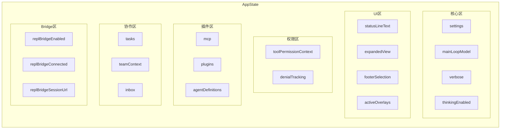

# 图解 Claude Code 完全指南 - 细纲

## 文件信息
- **原文件**: 03-app-state.md
- **类型**: 第 3 课：AppState 500+ 字段的组织之道
- **难度**: ★★☆☆☆

---

## 一、文档结构概览

### 1.1 学习目标
1. 理解 `AppState` 的整体结构和分域设计
2. 掌握 `DeepImmutable` 的作用和不可变数据原则
3. 学会 `getDefaultAppState()` 工厂函数的设计思路
4. 认识不同类型的状态字段（标量、对象、嵌套结构）
5. 理解为什么有些字段在 `DeepImmutable` 内，有些在外

### 1.2 章节结构
| 章节 | 主题 | 核心内容 |
|------|------|---------|
| 一、先看全貌 | AppState 规模 | 570行文件，380行类型定义 |
| 二、DeepImmutable | 不可变类型 | 状态的"只读护甲" |
| 三、字段分域详解 | 分区设计 | 核心、UI、权限、插件、协作、Bridge |
| 四、getDefaultAppState | 工厂函数 | 动态初始化策略 |
| 五、类型系统组合 | 高级类型 | 联合类型、状态机类型 |

---

## 二、关键知识点

### 2.1 AppState 规模
- 文件总行数：570 行
- 类型定义：约 380 行
- 字段数量：500+ 个

### 2.2 DeepImmutable：状态的"只读护甲"
```typescript
// 源码中的定义方式
export type AppState = DeepImmutable<{
  settings: SettingsJson
  verbose: boolean
  // ...
}> & {
  // 这些包含函数类型或可变引用——不适合 DeepImmutable
  tasks: { [taskId: string]: TaskState }
  agentNameRegistry: Map<string, AgentId>
  mcp: { clients: MCPServerConnection[]; ... }
  replContext?: { vmContext: import('vm').Context; ... }
}
```

**为什么分开？**
| 在 DeepImmutable 内 | 在 DeepImmutable 外 |
|---------------------|---------------------|
| 纯数据（string, number, boolean） | 包含函数的类型（TaskState） |
| 可以安全冻结 | 运行时需要调用方法 |
| 占大多数字段 | 少数特殊字段 |

### 2.3 状态分域总览


### 2.4 核心设置区字段
```typescript
settings: SettingsJson           // 用户的 settings.json 配置
verbose: boolean                 // 是否启用详细输出
mainLoopModel: ModelSetting      // 当前使用的 AI 模型
mainLoopModelForSession: ModelSetting  // 本次会话的模型（覆盖）
thinkingEnabled: boolean | undefined   // 是否启用深度思考
effortValue?: EffortValue        // 推理努力程度
fastMode?: boolean               // 快速模式
```

**设计亮点**：`mainLoopModel` vs `mainLoopModelForSession`——全局 vs 会话分层

### 2.5 Bridge 连接区字段（14个）
```typescript
replBridgeEnabled: boolean        // 是否启用
replBridgeExplicit: boolean       // 是否通过命令显式启用
replBridgeOutboundOnly: boolean   // 是否仅单向
replBridgeConnected: boolean      // 是否已连接
replBridgeSessionActive: boolean  // 会话是否活跃
replBridgeReconnecting: boolean   // 是否正在重连
replBridgeConnectUrl: string | undefined
replBridgeSessionUrl: string | undefined
replBridgeEnvironmentId: string | undefined
replBridgeSessionId: string | undefined
replBridgeError: string | undefined
replBridgeInitialName: string | undefined
showRemoteCallout: boolean
replBridgePermissionCallbacks?: BridgePermissionCallbacks
```

### 2.6 getDefaultAppState() 工厂函数
```typescript
export function getDefaultAppState(): AppState {
  return {
    settings: getInitialSettings(),     // 从配置文件读取
    tasks: {},
    agentNameRegistry: new Map(),       // 新的 Map 实例
    verbose: false,
    mainLoopModel: null,
    mainLoopModelForSession: null,
    toolPermissionContext: {
      ...getEmptyToolPermissionContext(),
      mode: initialMode,
    },
    mcp: {
      clients: [],
      tools: [],
      commands: [],
      resources: {},
      pluginReconnectKey: 0,
    },
    fileHistory: {
      snapshots: [],
      trackedFiles: new Set(),
      snapshotSequence: 0,
    },
    thinkingEnabled: shouldEnableThinkingByDefault(),
    promptSuggestionEnabled: shouldEnablePromptSuggestion(),
    sessionHooks: new Map(),
    // ...
  }
}
```

**三类初始值：**
| 类型 | 举例 | 特点 |
|------|------|------|
| 静态默认值 | `verbose: false` | 写死在代码里 |
| 动态计算值 | `thinkingEnabled: shouldEnableThinkingByDefault()` | 根据环境决定 |
| 从配置读取 | `settings: getInitialSettings()` | 从文件加载 |

### 2.7 联合类型实战：CompletionBoundary
```typescript
export type CompletionBoundary =
  | { type: 'complete'; completedAt: number; outputTokens: number }
  | { type: 'bash'; command: string; completedAt: number }
  | { type: 'edit'; toolName: string; filePath: string; completedAt: number }
  | { type: 'denied_tool'; toolName: string; detail: string; completedAt: number }
```

### 2.8 状态机类型：SpeculationState
```typescript
export type SpeculationState =
  | { status: 'idle' }
  | {
      status: 'active'
      id: string
      abort: () => void
      startTime: number
      messagesRef: { current: Message[] }
    }
```

---

## 三、关联文件索引

### 3.1 前置阅读
- [02-create-store.md](02-create-store.md) - createStore 源码解析

### 3.2 后续课程
- [04-side-effects.md](04-side-effects.md) - 副作用同步

### 3.3 核心源码文件
| 文件路径 | 职责 | 行数 |
|---------|------|------|
| `state/AppStateStore.ts` | AppState 类型定义 + 工厂函数 | 570 行 |

---

## 四、源码对应关系

### 4.1 核心类型
| 名称 | 类型 | 位置 | 说明 |
|------|------|------|------|
| `AppState` | type | `state/AppStateStore.ts` | 应用状态类型 |
| `DeepImmutable<T>` | type | `state/AppStateStore.ts` | 深度不可变类型 |
| `CompletionBoundary` | type | `state/AppStateStore.ts` | 完成边界联合类型 |
| `SpeculationState` | type | `state/AppStateStore.ts` | 推测执行状态机 |
| `ModelSetting` | type | `state/AppStateStore.ts` | 模型设置 |
| `SettingsJson` | type | `state/AppStateStore.ts` | 设置 JSON |

### 4.2 关键函数
| 函数名 | 位置 | 功能 |
|--------|------|------|
| `getDefaultAppState()` | `state/AppStateStore.ts` | 获取默认状态 |
| `getInitialSettings()` | `state/AppStateStore.ts` | 获取初始设置 |
| `getEmptyToolPermissionContext()` | `state/AppStateStore.ts` | 获取空权限上下文 |
| `shouldEnableThinkingByDefault()` | `state/AppStateStore.ts` | 是否默认启用思考 |
| `shouldEnablePromptSuggestion()` | `state/AppStateStore.ts` | 是否启用提示建议 |

---

## 五、本课小结

| 概念 | 解释 |
|------|------|
| 分域设计 | 把字段按功能分区（核心、UI、权限、插件、协作等） |
| DeepImmutable | 递归只读类型，防止直接修改状态 |
| 扁平 vs 嵌套 | Bridge 用扁平前缀、MCP 用嵌套对象——各有取舍 |
| 工厂函数 | `getDefaultAppState()` 每次返回新对象，避免共享引用 |
| 联合类型 | 用 `type` 字段区分不同状态，避免非法状态组合 |
| 动态初始化 | 部分字段根据环境、配置动态计算初始值 |

---

*此细纲由 Claude Code 自动生成，用于快速导航和内容概览*
