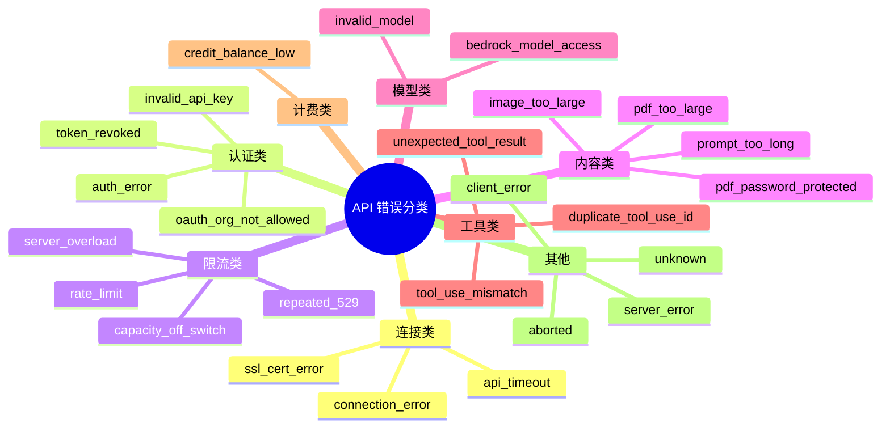
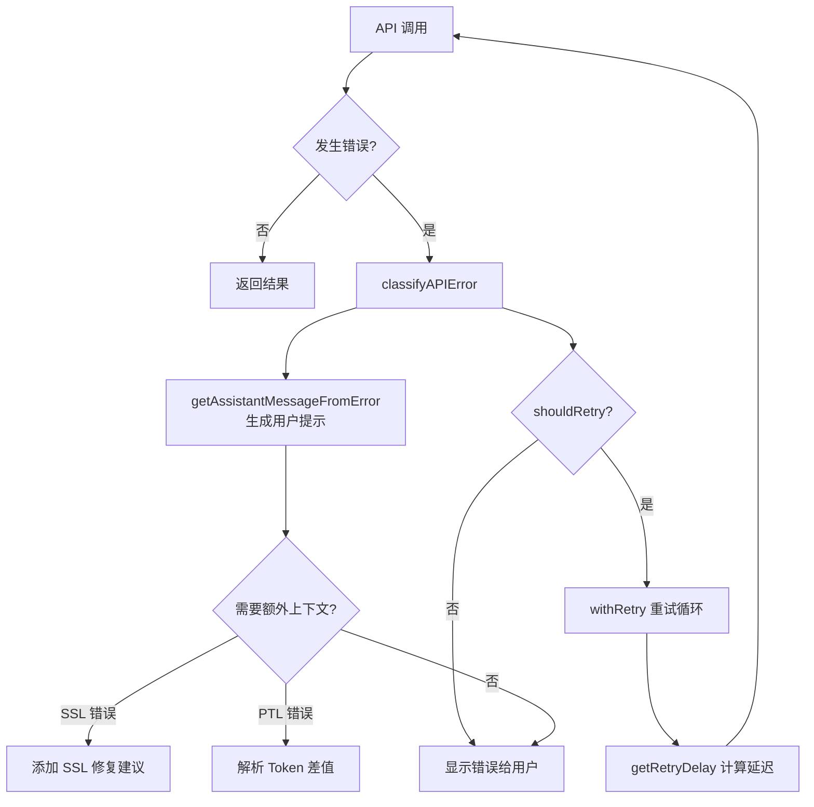

# 图解 Claude Code 完全指南 - 细纲

## 文件信息
- **原文件**: 03-error-handling.md
- **类型**: 第 3 课：错误分类与降级策略详解
- **难度**: ★★★☆☆

---

## 一、文档结构概览

### 1.1 学习目标
1. 理解 Claude Code 如何将 API 错误分类为 20+ 种具体类型
2. 掌握错误处理的分层架构：识别 → 分类 → 提示 → 恢复
3. 学会 SSL/TLS 错误链遍历技术
4. 了解"用户友好错误提示"的设计哲学

### 1.2 章节结构
| 章节 | 主题 | 核心内容 |
|------|------|---------|
| 一、"医院分诊台"的比喻 | 概念入门 | 错误分类类比 |
| 二、错误分类体系 | 核心实现 | classifyAPIError |
| 三、用户友好的错误提示 | 设计原则 | 提示信息设计 |
| 四、SSL/TLS 错误链遍历 | 技术细节 | 错误链遍历算法 |
| 五、Prompt-Too-Long 解析 | 特殊处理 | Token 差值计算 |
| 六、错误处理流程总览 | 全局视图 | 完整流程图 |

---

## 二、关键知识点

### 2.1 错误分诊函数
```typescript
// services/api/errors.ts
export function classifyAPIError(error: unknown): string {
  // 用户取消
  if (error instanceof Error && error.message === 'Request was aborted.') {
    return 'aborted'
  }
  // 超时
  if (error instanceof APIConnectionTimeoutError) {
    return 'api_timeout'
  }
  // 限速
  if (error instanceof APIError && error.status === 429) {
    return 'rate_limit'
  }
  // 服务器过载
  if (error instanceof APIError && error.status === 529) {
    return 'server_overload'
  }
  // ... 20+ 种错误类型
  return 'unknown'
}
```

### 2.2 完整的错误分类表


### 2.3 提示信息设计原则
Claude Code 的错误提示遵循一个公式：**问题描述 · 操作建议**

```typescript
export const INVALID_API_KEY_ERROR_MESSAGE =
  'Not logged in · Please run /login'

export const CREDIT_BALANCE_TOO_LOW_ERROR_MESSAGE =
  'Credit balance is too low'

export const TOKEN_REVOKED_ERROR_MESSAGE =
  'OAuth token revoked · Please run /login'
```

### 2.4 场景感知的提示
```typescript
export function getImageTooLargeErrorMessage(): string {
  return getIsNonInteractiveSession()
    ? 'Image was too large. Try resizing the image or using a different approach.'
    : 'Image was too large. Double press esc to go back and try again with a smaller image.'
}
```

| 场景 | 提示内容 |
|------|---------|
| CLI 交互模式 | "按两次 esc 返回" |
| SDK/CI 模式 | "尝试缩小图片或换一种方式" |

### 2.5 错误消息构建器
```typescript
export function getAssistantMessageFromError(
  error: unknown,
  model: string,
): AssistantMessage {
  // 1. 超时错误
  if (error instanceof APIConnectionTimeoutError) {
    return createAssistantAPIErrorMessage({
      content: API_TIMEOUT_ERROR_MESSAGE,
      error: 'unknown',
    })
  }

  // 2. 429 限速 —— 最复杂的分支
  if (error instanceof APIError && error.status === 429) {
    // 解析新版限速头
    const rateLimitType = error.headers?.get?.(
      'anthropic-ratelimit-unified-representative-claim',
    )
    // ... 复杂的限速处理逻辑
  }

  // 3. Prompt 过长
  if (error.message.toLowerCase().includes('prompt is too long')) {
    return createAssistantAPIErrorMessage({
      content: PROMPT_TOO_LONG_ERROR_MESSAGE,
      error: 'invalid_request',
      errorDetails: error.message,  // 保留原始信息用于重试
    })
  }

  // ... 更多分支
}
```

### 2.6 SSL/TLS 错误链遍历算法
```typescript
// services/api/errorUtils.ts
export function extractConnectionErrorDetails(
  error: unknown,
): ConnectionErrorDetails | null {
  let current: unknown = error
  const maxDepth = 5  // 最多遍历 5 层，防止无限循环

  while (current && depth < maxDepth) {
    if (
      current instanceof Error &&
      'code' in current &&
      typeof current.code === 'string'
    ) {
      const code = current.code
      const isSSLError = SSL_ERROR_CODES.has(code)
      return { code, message: current.message, isSSLError }
    }
    // 沿 cause 链向下走
    if (current instanceof Error && 'cause' in current) {
      current = current.cause
      depth++
    } else {
      break
    }
  }
  return null
}
```

### 2.7 SSL 错误码集合
```typescript
const SSL_ERROR_CODES = new Set([
  'UNABLE_TO_VERIFY_LEAF_SIGNATURE',    // 无法验证叶证书
  'DEPTH_ZERO_SELF_SIGNED_CERT',        // 自签名证书
  'SELF_SIGNED_CERT_IN_CHAIN',          // 链中有自签名证书
  'CERT_HAS_EXPIRED',                    // 证书已过期
  'CERT_REVOKED',                        // 证书被吊销
  'ERR_TLS_CERT_ALTNAME_INVALID',       // 主机名不匹配
  // ...
])
```

### 2.8 Prompt-Too-Long Token 解析
```typescript
export function parsePromptTooLongTokenCounts(rawMessage: string): {
  actualTokens: number | undefined
  limitTokens: number | undefined
} {
  // 匹配："prompt is too long: 137500 tokens > 135000 maximum"
  const match = rawMessage.match(
    /prompt is too long[^0-9]*(\d+)\s*tokens?\s*>\s*(\d+)/i,
  )
  return {
    actualTokens: match ? parseInt(match[1]!, 10) : undefined,
    limitTokens: match ? parseInt(match[2]!, 10) : undefined,
  }
}
```

### 2.9 计算 Token 差值
```typescript
export function getPromptTooLongTokenGap(
  msg: AssistantMessage,
): number | undefined {
  const { actualTokens, limitTokens } = parsePromptTooLongTokenCounts(
    msg.errorDetails,
  )
  const gap = actualTokens - limitTokens
  return gap > 0 ? gap : undefined
}
```

### 2.10 错误处理流程总览


---

## 三、关联文件索引

### 3.1 前置阅读
- [02-api-client.md](02-api-client.md) - API 客户端封装

### 3.2 后续课程
- [04-mcp-protocol.md](04-mcp-protocol.md) - MCP 协议

### 3.3 核心源码文件
| 文件路径 | 职责 | 行数 |
|---------|------|------|
| `services/api/errors.ts` | 错误分类与提示 | ~300 行 |
| `services/api/errorUtils.ts` | 错误工具函数 | ~100 行 |

---

## 四、源码对应关系

### 4.1 核心函数
| 函数名 | 位置 | 功能 |
|--------|------|------|
| `classifyAPIError()` | `services/api/errors.ts` | 错误分类 |
| `getAssistantMessageFromError()` | `services/api/errors.ts` | 生成用户提示 |
| `extractConnectionErrorDetails()` | `services/api/errorUtils.ts` | SSL 错误链遍历 |
| `parsePromptTooLongTokenCounts()` | `services/api/errors.ts` | 解析 Token 数量 |
| `getPromptTooLongTokenGap()` | `services/api/errors.ts` | 计算 Token 差值 |

### 4.2 核心常量
| 常量名 | 值 | 说明 |
|--------|-----|------|
| `SSL_ERROR_CODES` | Set | SSL 错误码集合 |
| `maxDepth` | 5 | 错误链最大遍历深度 |

### 4.3 错误消息常量
| 常量名 | 内容 |
|--------|------|
| `INVALID_API_KEY_ERROR_MESSAGE` | 'Not logged in · Please run /login' |
| `CREDIT_BALANCE_TOO_LOW_ERROR_MESSAGE` | 'Credit balance is too low' |
| `TOKEN_REVOKED_ERROR_MESSAGE` | 'OAuth token revoked · Please run /login' |
| `API_TIMEOUT_ERROR_MESSAGE` | 'API timeout error' |
| `PROMPT_TOO_LONG_ERROR_MESSAGE` | 'Prompt is too long' |

---

## 五、本课小结

| 概念 | 解释 |
|------|------|
| 错误分类 | 20+ 种 API 错误类型，每种都有专门的处理策略 |
| 提示设计 | "问题 · 操作建议" 格式，根据运行环境调整 |
| SSL 遍历 | 错误链遍历技术从嵌套的 cause 中提取真正的错误码 |
| Token 解析 | Prompt-Too-Long 错误解析出精确的 Token 差值 |
| 完整闭环 | 识别 → 分类 → 提示 → 恢复 |

---

*此细纲由 Claude Code 自动生成，用于快速导航和内容概览*
