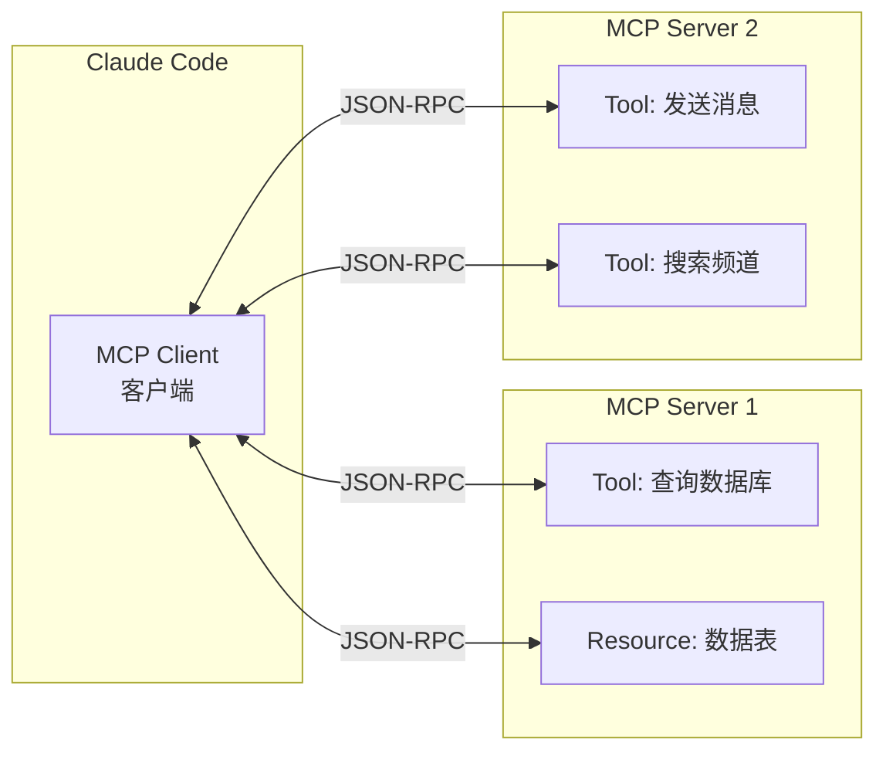
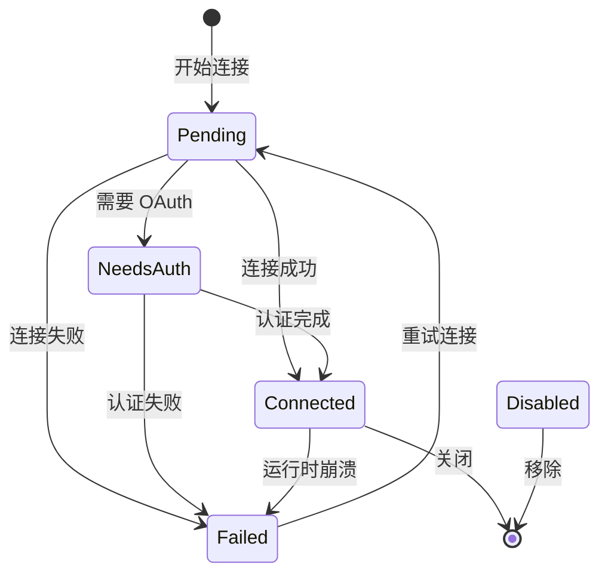
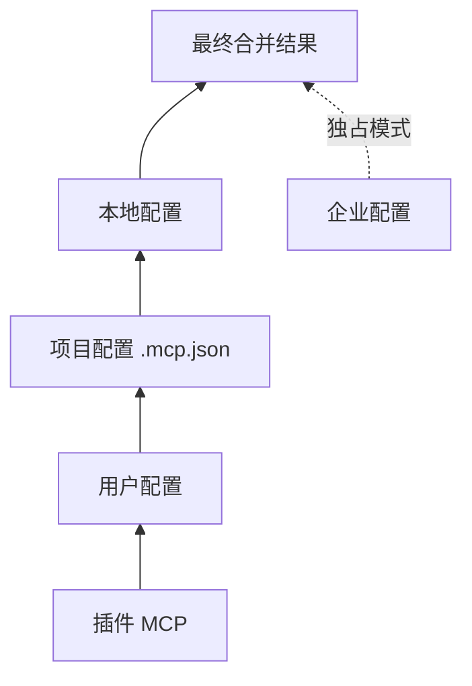
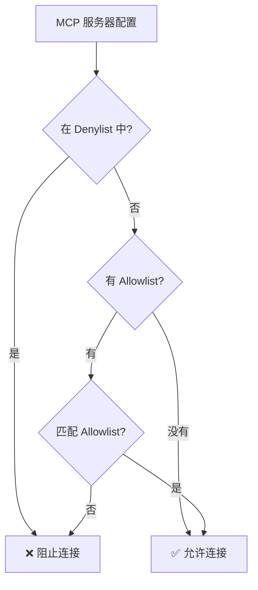

# 图解 Claude Code 完全指南 - 细纲

## 文件信息
- **原文件**: 04-mcp-protocol.md
- **类型**: 第 4 课：MCP 模型上下文协议深入
- **难度**: ★★★☆☆

---

## 一、文档结构概览

### 1.1 学习目标
1. 理解 MCP（Model Context Protocol）的设计理念和解决的问题
2. 掌握 MCP 的核心概念：Server、Client、Tool、Resource
3. 学会从源码中识别 MCP 服务器的配置体系（类型定义、作用域、策略过滤）
4. 了解 MCP 连接的生命周期和状态管理

### 1.2 章节结构
| 章节 | 主题 | 核心内容 |
|------|------|---------|
| 一、"万能插座"的比喻 | 概念入门 | MCP 类比 |
| 二、MCP 的核心概念 | 核心知识 | Server/Client/Tool/Resource |
| 三、MCP 服务器类型定义 | 类型系统 | 8 种服务器类型 |
| 四、配置管理的作用域体系 | 配置体系 | 7 种作用域 |
| 五、安全策略 | 安全设计 | Allowlist/Denylist |
| 六、插件去重机制 | 实现细节 | 服务器指纹 |

---

## 二、关键知识点

### 2.1 MCP 四大组件


| 组件 | 作用 | 类比 |
|------|------|------|
| **Client** | 发起请求的一方（Claude Code） | 你的手机 |
| **Server** | 提供工具和资源的一方 | App 后端 |
| **Tool** | 可执行的操作（函数调用） | App 的功能按钮 |
| **Resource** | 可读取的数据 | App 展示的内容 |

### 2.2 连接状态
```typescript
// services/mcp/types.ts — 五种连接状态
export type MCPServerConnection =
  | ConnectedMCPServer    // 已连接，可用
  | FailedMCPServer       // 连接失败
  | NeedsAuthMCPServer    // 需要认证
  | PendingMCPServer      // 连接中
  | DisabledMCPServer     // 被禁用
```



### 2.3 八种服务器类型
```typescript
// services/mcp/types.ts
export const McpServerConfigSchema = lazySchema(() =>
  z.union([
    McpStdioServerConfigSchema(),     // stdio: 本地子进程
    McpSSEServerConfigSchema(),       // sse: 服务器推送事件
    McpSSEIDEServerConfigSchema(),    // sse-ide: IDE 专用 SSE
    McpWebSocketIDEServerConfigSchema(), // ws-ide: IDE 专用 WebSocket
    McpHTTPServerConfigSchema(),      // http: HTTP 流式传输
    McpWebSocketServerConfigSchema(), // ws: WebSocket
    McpSdkServerConfigSchema(),       // sdk: SDK 内嵌
    McpClaudeAIProxyServerConfigSchema(), // claudeai-proxy: Claude.ai 代理
  ]),
)
```

### 2.4 Stdio 类型配置
```typescript
export const McpStdioServerConfigSchema = lazySchema(() =>
  z.object({
    type: z.literal('stdio').optional(), // 可省略（向后兼容）
    command: z.string().min(1),          // 启动命令
    args: z.array(z.string()).default([]), // 命令参数
    env: z.record(z.string(), z.string()).optional(), // 环境变量
  }),
)
```

### 2.5 HTTP 类型配置
```typescript
export const McpHTTPServerConfigSchema = lazySchema(() =>
  z.object({
    type: z.literal('http'),
    url: z.string(),                     // 服务器 URL
    headers: z.record(z.string(), z.string()).optional(),
    oauth: McpOAuthConfigSchema().optional(), // 可选 OAuth 认证
  }),
)
```

### 2.6 七种配置作用域
```typescript
export const ConfigScopeSchema = lazySchema(() =>
  z.enum([
    'local',       // 项目本地 (.claude/settings.local.json)
    'user',        // 用户全局 (~/.claude.json)
    'project',     // 项目共享 (.mcp.json)
    'dynamic',     // 运行时动态注入
    'enterprise',  // 企业管理
    'claudeai',    // Claude.ai 连接器
    'managed',     // 托管配置
  ]),
)
```

### 2.7 配置优先级


企业配置有**独占控制权** —— 如果存在企业 MCP 配置文件，其他所有来源都会被忽略。

### 2.8 多层配置合并代码
```typescript
// services/mcp/config.ts
export async function getClaudeCodeMcpConfigs(): Promise<{
  servers: Record<string, ScopedMcpServerConfig>
}> {
  // 检查企业配置是否存在
  if (doesEnterpriseMcpConfigExist()) {
    return { servers: filtered, errors: [] }  // 独占返回
  }

  // 否则按优先级合并
  const configs = Object.assign(
    {},
    dedupedPluginServers,    // 最低优先级
    userServers,             // 用户配置
    approvedProjectServers,  // 项目配置（需审批）
    localServers,            // 最高优先级
  )
  // ...
}
```

### 2.9 安全策略：Allowlist / Denylist


### 2.10 三种匹配维度
```typescript
// 按名称匹配
{ serverName: 'my-slack-server' }

// 按命令匹配（stdio 服务器）
{ serverCommand: ['npx', '@modelcontextprotocol/server-slack'] }

// 按 URL 匹配（远程服务器，支持通配符）
{ serverUrl: 'https://*.example.com/*' }
```

### 2.11 URL 通配符匹配
```typescript
function urlPatternToRegex(pattern: string): RegExp {
  const escaped = pattern.replace(/[.+?^${}()|[\]\\]/g, '\\$&')
  const regexStr = escaped.replace(/\*/g, '.*')
  return new RegExp(`^${regexStr}$`)
}
```

示例：
- `https://example.com/*` → 匹配 `https://example.com/api/v1`
- `https://*.example.com/*` → 匹配 `https://api.example.com/path`

### 2.12 插件去重机制
```typescript
// 计算服务器"指纹"
export function getMcpServerSignature(config: McpServerConfig): string | null {
  const cmd = getServerCommandArray(config)
  if (cmd) {
    return `stdio:${jsonStringify(cmd)}`  // stdio → 命令指纹
  }
  const url = getServerUrl(config)
  if (url) {
    return `url:${unwrapCcrProxyUrl(url)}`  // 远程 → URL 指纹
  }
  return null  // SDK 类型没有指纹
}
```

去重规则：
1. **手动配置 > 插件配置**：同一服务器，手动优先
2. **先注册 > 后注册**：插件之间先到先得
3. **启用的 > 禁用的**：只有启用的配置参与去重

---

## 三、关联文件索引

### 3.1 前置阅读
- [03-error-handling.md](03-error-handling.md) - 错误处理

### 3.2 后续课程
- [05-mcp-transport.md](05-mcp-transport.md) - MCP 传输方式

### 3.3 核心源码文件
| 文件路径 | 职责 | 行数 |
|---------|------|------|
| `services/mcp/types.ts` | MCP 类型定义 | ~200 行 |
| `services/mcp/config.ts` | 配置管理 | ~300 行 |

---

## 四、源码对应关系

### 4.1 核心类型
| 名称 | 类型 | 位置 | 说明 |
|------|------|------|------|
| `MCPServerConnection` | type | `services/mcp/types.ts` | 连接状态联合类型 |
| `McpServerConfigSchema` | schema | `services/mcp/types.ts` | 服务器配置 Schema |
| `ConfigScopeSchema` | schema | `services/mcp/types.ts` | 配置作用域 |

### 4.2 核心函数
| 函数名 | 位置 | 功能 |
|--------|------|------|
| `getClaudeCodeMcpConfigs()` | `services/mcp/config.ts` | 获取合并后的 MCP 配置 |
| `getMcpServerSignature()` | `services/mcp/config.ts` | 计算服务器指纹 |
| `doesEnterpriseMcpConfigExist()` | `services/mcp/config.ts` | 检查企业配置 |
| `urlPatternToRegex()` | `services/mcp/config.ts` | URL 通配符转正则 |

---

## 五、本课小结

| 概念 | 解释 |
|------|------|
| MCP | AI 调用外部工具的标准化协议，基于 JSON-RPC |
| 四大组件 | Client、Server、Tool、Resource |
| 8 种服务器类型 | stdio、sse、http、ws、sdk 等 |
| 7 种作用域 | local、user、project、enterprise 等 |
| 企业独占 | 企业配置存在时，其他来源被忽略 |
| 安全策略 | Denylist 优先 + Allowlist 过滤 |
| 去重算法 | 服务器指纹（命令或 URL） |

---

*此细纲由 Claude Code 自动生成，用于快速导航和内容概览*
