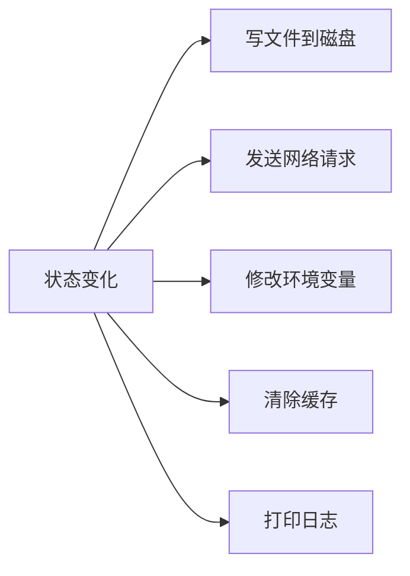

# 图解 Claude Code 完全指南 - 细纲

## 文件信息
- **原文件**: 04-side-effects.md
- **类型**: 第 4 课：副作用同步 —— onChangeAppState 收口设计
- **难度**: ★★☆☆☆

---

## 一、文档结构概览

### 1.1 学习目标
1. 理解什么是"副作用"，以及为什么需要统一管理
2. 掌握 `onChangeAppState` 的差异检测模式
3. 学会分析每种副作用的触发条件和执行逻辑
4. 理解"收口"设计的优势——对比分散式副作用的痛点
5. 认识 `externalMetadataToAppState` 的逆向同步

### 1.2 章节结构
| 章节 | 主题 | 核心内容 |
|------|------|---------|
| 一、什么是副作用？ | 概念入门 | 温度计和空调类比 |
| 二、onChange 连接 | 架构设计 | 如何连上 Store |
| 三、onChangeAppState 逐段解析 | 源码详解 | 6 种副作用类型 |
| 四、副作用完整清单 | 全局视图 | 所有副作用一览 |
| 五、逆向同步 | 双向数据流 | externalMetadataToAppState |

---

## 二、关键知识点

### 2.1 副作用的定义
**副作用** = 由状态变化自动触发的、在状态管理系统之外发生的操作



### 2.2 收口设计 vs 分散式设计
```
❌ 分散式：每个修改状态的地方各自处理副作用
   setAppState(prev => ({ ...prev, verbose: true }))
   saveGlobalConfig({ verbose: true })   // 每个调用方自己写
   // 问题：容易漏掉！有 8 个地方改权限模式，只有 2 个通知了远端

✅ 收口式：所有副作用集中在 onChange 回调中
   setAppState(prev => ({ ...prev, verbose: true }))
   // onChange 自动检测到 verbose 变了，自动保存配置
```

### 2.3 onChangeAppState 函数签名
```typescript
// 源码文件：state/onChangeAppState.ts
export function onChangeAppState({
  newState,
  oldState,
}: {
  newState: AppState
  oldState: AppState
}) {
  // 通过比较 newState 和 oldState 的差异来决定执行哪些副作用
}
```

### 2.4 副作用 #1：权限模式同步
```typescript
// 源码：state/onChangeAppState.ts 第 50-92 行
const prevMode = oldState.toolPermissionContext.mode
const newMode = newState.toolPermissionContext.mode
if (prevMode !== newMode) {
  const prevExternal = toExternalPermissionMode(prevMode)
  const newExternal = toExternalPermissionMode(newMode)
  if (prevExternal !== newExternal) {
    const isUltraplan =
      newExternal === 'plan' &&
      newState.isUltraplanMode &&
      !oldState.isUltraplanMode
        ? true
        : null
    notifySessionMetadataChanged({
      permission_mode: newExternal,
      is_ultraplan_mode: isUltraplan,
    })
  }
  notifyPermissionModeChanged(newMode)
}
```

### 2.5 副作用清单
| 副作用 | 触发条件 | 操作 |
|--------|---------|------|
| 权限模式同步 | `toolPermissionContext.mode` 变化 | 通知远端 + SDK |
| 模型设置保存 | `mainLoopModel` 变化 | 更新 settings.json |
| 展开视图持久化 | `expandedView` 变化 | 保存到 GlobalConfig |
| verbose 保存 | `verbose` 变化 | 保存到 GlobalConfig |
| tmux 面板变化 | `tungstenPanelVisible` 变化 | 保存到 GlobalConfig |
| settings 变化清缓存 | `settings` 变化 | 清缓存 + 更新环境变量 |

### 2.6 收口模式检查清单模板
```typescript
if (newState.XXX !== oldState.XXX) {    // ① 字段变了吗？
  if (/* 额外条件 */) {                 // ② 需要进一步筛选？
    doSideEffect(newState.XXX)           // ③ 执行副作用
  }
}
```

### 2.7 双重检查避免无意义写入
```typescript
// 先检查 AppState 变没变
if (newState.verbose !== oldState.verbose) {
  // 再检查磁盘上的值是否已经正确
  if (getGlobalConfig().verbose !== newState.verbose) {
    saveGlobalConfig(...)  // 真正需要写才写
  }
}
```

### 2.8 逆向同步：externalMetadataToAppState
```typescript
// 源码：state/onChangeAppState.ts
export function externalMetadataToAppState(
  metadata: SessionExternalMetadata,
): (prev: AppState) => AppState {
  return prev => ({
    ...prev,
    ...(typeof metadata.permission_mode === 'string'
      ? {
          toolPermissionContext: {
            ...prev.toolPermissionContext,
            mode: permissionModeFromString(metadata.permission_mode),
          },
        }
      : {}),
    ...(typeof metadata.is_ultraplan_mode === 'boolean'
      ? { isUltraplanMode: metadata.is_ultraplan_mode }
      : {}),
  })
}
```

**设计亮点**：返回 `(prev: AppState) => AppState`——正好是 `setState` 需要的 updater 格式！

---

## 三、关联文件索引

### 3.1 前置阅读
- [03-app-state.md](03-app-state.md) - AppState 组织之道

### 3.2 后续课程
- [05-memdir-memory.md](05-memdir-memory.md) - Memdir 记忆系统

### 3.3 核心源码文件
| 文件路径 | 职责 | 行数 |
|---------|------|------|
| `state/onChangeAppState.ts` | 副作用收口 | 172 行 |

---

## 四、源码对应关系

### 4.1 核心函数
| 函数名 | 位置 | 功能 | 参数 |
|--------|------|------|------|
| `onChangeAppState()` | `state/onChangeAppState.ts` | 副作用收口 | `{ newState, oldState }` |
| `externalMetadataToAppState()` | `state/onChangeAppState.ts` | 逆向同步 | `metadata: SessionExternalMetadata` |
| `toExternalPermissionMode()` | `state/onChangeAppState.ts` | 权限模式转换 | `mode: PermissionMode` |
| `notifySessionMetadataChanged()` | `state/onChangeAppState.ts` | 通知远端 | `metadata` |
| `notifyPermissionModeChanged()` | `state/onChangeAppState.ts` | 通知 SDK | `mode: PermissionMode` |

### 4.2 副作用函数
| 函数名 | 位置 | 功能 |
|--------|------|------|
| `updateSettingsForSource()` | 外部 | 更新设置 |
| `setMainLoopModelOverride()` | 外部 | 设置模型覆盖 |
| `saveGlobalConfig()` | 外部 | 保存全局配置 |
| `clearApiKeyHelperCache()` | 外部 | 清除 API Key 缓存 |
| `clearAwsCredentialsCache()` | 外部 | 清除 AWS 凭证缓存 |
| `clearGcpCredentialsCache()` | 外部 | 清除 GCP 凭证缓存 |
| `applyConfigEnvironmentVariables()` | 外部 | 应用环境变量 |

---

## 五、本课小结

| 概念 | 解释 |
|------|------|
| 副作用 | 状态变化自动触发的外部操作（写文件、发请求、清缓存） |
| 收口设计 | 所有副作用集中在 onChange 一个函数中处理 |
| 差异检测 | 比较 newState 和 oldState 的具体字段来决定触发 |
| 双重检查 | 先检查 AppState 变没变，再检查目标是否需要更新 |
| 逆向同步 | externalMetadataToAppState 将外部变更转为状态更新器 |
| 容错设计 | 副作用用 try/catch 包裹，不影响主流程 |

---

*此细纲由 Claude Code 自动生成，用于快速导航和内容概览*
