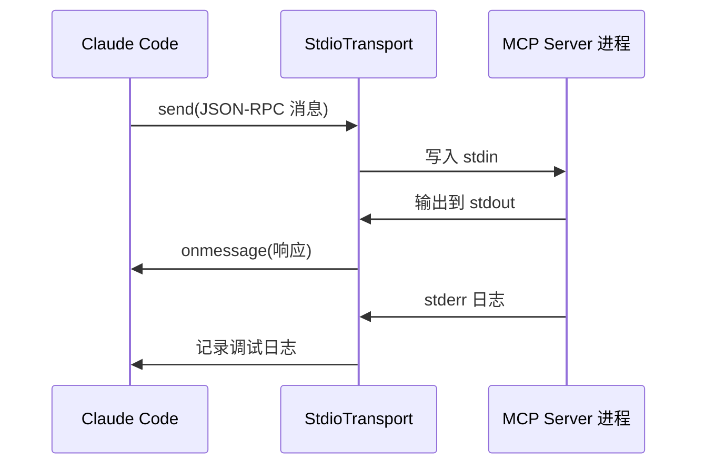
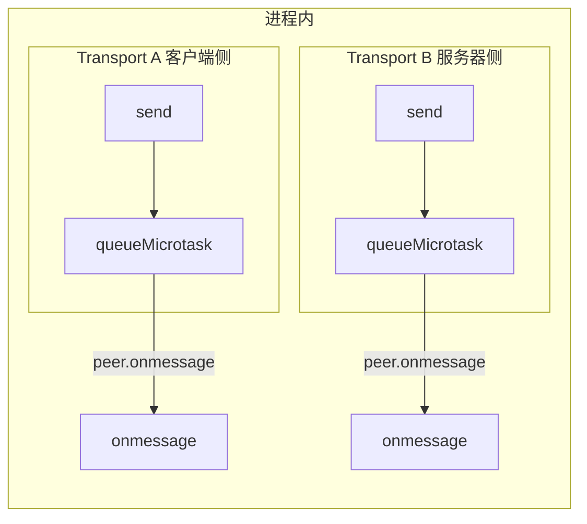
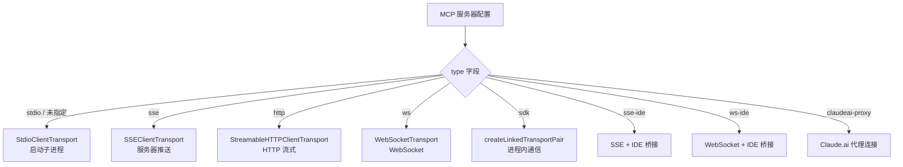
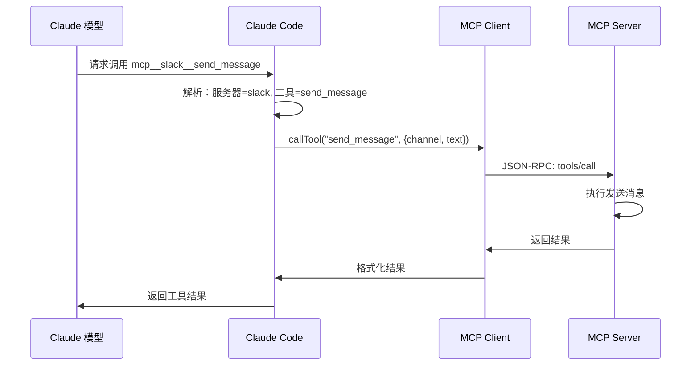

# 图解 Claude Code 完全指南 - 细纲

## 文件信息
- **原文件**: 05-mcp-transport.md
- **类型**: 第 5 课：MCP 五种传输方式与工具发现
- **难度**: ★★★☆☆

---

## 一、文档结构概览

### 1.1 学习目标
1. 理解 MCP 五种传输方式的适用场景和技术差异
2. 掌握 In-Process Transport 的双向消息传递原理
3. 学会 MCP 工具发现、注册和调用的完整流程
4. 了解环境变量展开和配置验证的实现细节

### 1.2 章节结构
| 章节 | 主题 | 核心内容 |
|------|------|---------|
| 一、"通信方式"的比喻 | 概念入门 | 传输方式类比 |
| 二、Stdio 传输 | 传输方式 | 子进程标准输入输出 |
| 三、HTTP/SSE 传输 | 传输方式 | 远程服务器 |
| 四、WebSocket 传输 | 传输方式 | 实时双向 |
| 五、In-Process 传输 | 核心实现 | 零延迟通信 |
| 六、传输方式选择决策 | 决策树 | 如何选择传输方式 |
| 七、工具发现与注册 | 流程 | listTools、名称规范化 |
| 八、环境变量展开 | 实用功能 | ${VAR} 语法 |

---

## 二、关键知识点

### 2.1 传输方式类比
| 传输方式 | 类比 | 特点 |
|---------|------|------|
| **Stdio** | 对讲机 | 最简单，面对面，延迟低 |
| **SSE** | 广播电台 | 服务器单向推送，客户端HTTP请求 |
| **HTTP** | 打电话 | 一来一回，标准请求/响应 |
| **WebSocket** | 视频通话 | 双向实时，保持长连接 |
| **In-Process** | 自言自语 | 同进程内通信，零延迟 |

### 2.2 Stdio 传输
```typescript
// MCP SDK 的 StdioClientTransport
import { StdioClientTransport } from '@modelcontextprotocol/sdk/client/stdio.js'

// 启动 MCP 服务器子进程
const transport = new StdioClientTransport({
  command: 'npx',
  args: ['@modelcontextprotocol/server-slack'],
  env: { SLACK_TOKEN: 'xoxb-...' },
})
```



### 2.3 SSE 传输
```typescript
import {
  SSEClientTransport,
} from '@modelcontextprotocol/sdk/client/sse.js'

// SSE 连接：服务器可以主动推送
const transport = new SSEClientTransport(url, {
  requestInit: {
    headers: { Authorization: 'Bearer token' }
  }
})
```

### 2.4 Streamable HTTP 传输
```typescript
import {
  StreamableHTTPClientTransport,
} from '@modelcontextprotocol/sdk/client/streamableHttp.js'

// HTTP 流式传输：支持双向流
const transport = new StreamableHTTPClientTransport(url, {
  requestInit: {
    headers: customHeaders
  }
})
```

### 2.5 WebSocket 传输
```typescript
import { WebSocketTransport } from '../../utils/mcpWebSocketTransport.js'

// WebSocket 连接
const transport = new WebSocketTransport(url, {
  headers: customHeaders,
  // 支持 TLS 客户端证书
  ...getWebSocketTLSOptions(),
  // 支持 HTTP 代理
  agent: getWebSocketProxyAgent(),
})
```

### 2.6 In-Process 传输
```typescript
// services/mcp/InProcessTransport.ts
class InProcessTransport implements Transport {
  private peer: InProcessTransport | undefined
  private closed = false

  onmessage?: (message: JSONRPCMessage) => void

  async send(message: JSONRPCMessage): Promise<void> {
    if (this.closed) {
      throw new Error('Transport is closed')
    }
    // 异步投递到对端，避免栈溢出
    queueMicrotask(() => {
      this.peer?.onmessage?.(message)
    })
  }

  async close(): Promise<void> {
    if (this.closed) return
    this.closed = true
    this.onclose?.()
    // 同时关闭对端
    if (this.peer && !this.peer.closed) {
      this.peer.closed = true
      this.peer.onclose?.()
    }
  }
}

// 创建配对的传输通道
export function createLinkedTransportPair(): [Transport, Transport] {
  const a = new InProcessTransport()
  const b = new InProcessTransport()
  a._setPeer(b)  // A 的发送 → B 的接收
  b._setPeer(a)  // B 的发送 → A 的接收
  return [a, b]
}
```

### 2.7 In-Process 工作原理


**为什么用 `queueMicrotask` 而不是直接调用？**

避免同步请求/响应导致的栈溢出。如果 A 发送消息后 B 立即响应，B 的响应又触发 A 的处理……无限递归！微任务队列打破了这个同步调用链。

### 2.8 传输方式选择决策


### 2.9 工具发现
```typescript
// 连接 MCP 服务器后，列出可用工具
const toolsResult: ListToolsResult = await client.listTools()

// 工具定义结构
interface SerializedTool {
  name: string
  description: string
  inputJSONSchema?: {
    type: 'object'
    properties?: Record<string, unknown>
  }
  isMcp?: boolean
  originalToolName?: string  // MCP 原始名称
}
```

### 2.10 工具名称规范化
```typescript
// services/mcp/mcpStringUtils.ts
// "server-name" + "tool-name" → "mcp__server_name__tool_name"
export function buildMcpToolName(
  serverName: string,
  toolName: string,
): string {
  // 规范化：替换特殊字符，添加前缀
}
```

### 2.11 工具调用流程


### 2.12 环境变量展开
```typescript
// services/mcp/config.ts — expandEnvVars
function expandEnvVars(config: McpServerConfig): {
  expanded: McpServerConfig
  missingVars: string[]
} {
  function expandString(str: string): string {
    const { expanded, missingVars: vars } = expandEnvVarsInString(str)
    missingVars.push(...vars)
    return expanded
  }

  // 对不同类型的配置展开不同字段
  switch (config.type) {
    case 'stdio':
      return {
        command: expandString(config.command),
        args: config.args.map(expandString),
        env: config.env ? mapValues(config.env, expandString) : undefined,
      }
    case 'http':
      return {
        url: expandString(config.url),
        headers: config.headers ? mapValues(config.headers, expandString) : undefined,
      }
  }
}
```

示例配置：
```json
{
  "mcpServers": {
    "my-db": {
      "command": "npx",
      "args": ["@mcp/server-postgres"],
      "env": {
        "DATABASE_URL": "${POSTGRES_URL}"
      }
    }
  }
}
```

---

## 三、关联文件索引

### 3.1 前置阅读
- [04-mcp-protocol.md](04-mcp-protocol.md) - MCP 协议

### 3.2 后续课程
- [06-lsp-integration.md](06-lsp-integration.md) - LSP 集成

### 3.3 核心源码文件
| 文件路径 | 职责 | 行数 |
|---------|------|------|
| `services/mcp/InProcessTransport.ts` | 进程内传输 | ~100 行 |
| `services/mcp/mcpStringUtils.ts` | 工具名称规范化 | ~50 行 |
| `services/mcp/config.ts` | 环境变量展开 | ~300 行 |

---

## 四、源码对应关系

### 4.1 核心类
| 类名 | 位置 | 说明 |
|------|------|------|
| `InProcessTransport` | `services/mcp/InProcessTransport.ts` | 进程内传输实现 |

### 4.2 核心函数
| 函数名 | 位置 | 功能 |
|--------|------|------|
| `createLinkedTransportPair()` | `services/mcp/InProcessTransport.ts` | 创建配对的传输通道 |
| `buildMcpToolName()` | `services/mcp/mcpStringUtils.ts` | 构建 MCP 工具名称 |
| `expandEnvVars()` | `services/mcp/config.ts` | 展开环境变量 |

### 4.3 核心常量
| 常量名 | 值 | 说明 |
|--------|-----|------|
| MCP 工具前缀 | `mcp__` | 规范化后的工具名前缀 |

---

## 五、本课小结

| 概念 | 解释 |
|------|------|
| 5 种传输方式 | Stdio、SSE、HTTP、WebSocket、In-Process |
| In-Process | 通过配对的传输通道实现零延迟进程内通信 |
| queueMicrotask | 避免同步消息循环导致的栈溢出 |
| 工具发现 | 通过 `listTools()` 完成 |
| 名称规范化 | "server-name" + "tool-name" → "mcp__server_name__tool_name" |
| 环境变量展开 | 支持 `${VAR}` 语法 |

---

*此细纲由 Claude Code 自动生成，用于快速导航和内容概览*
