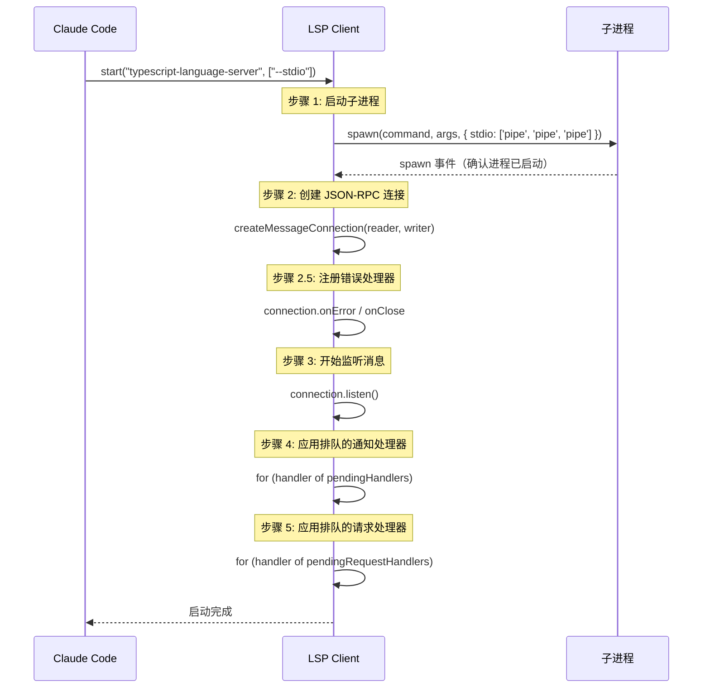
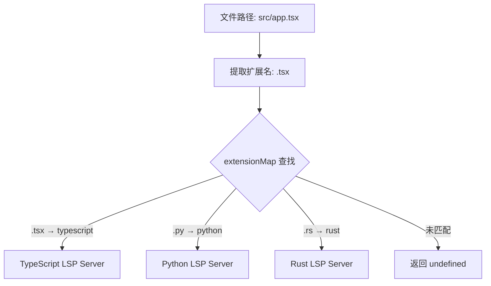
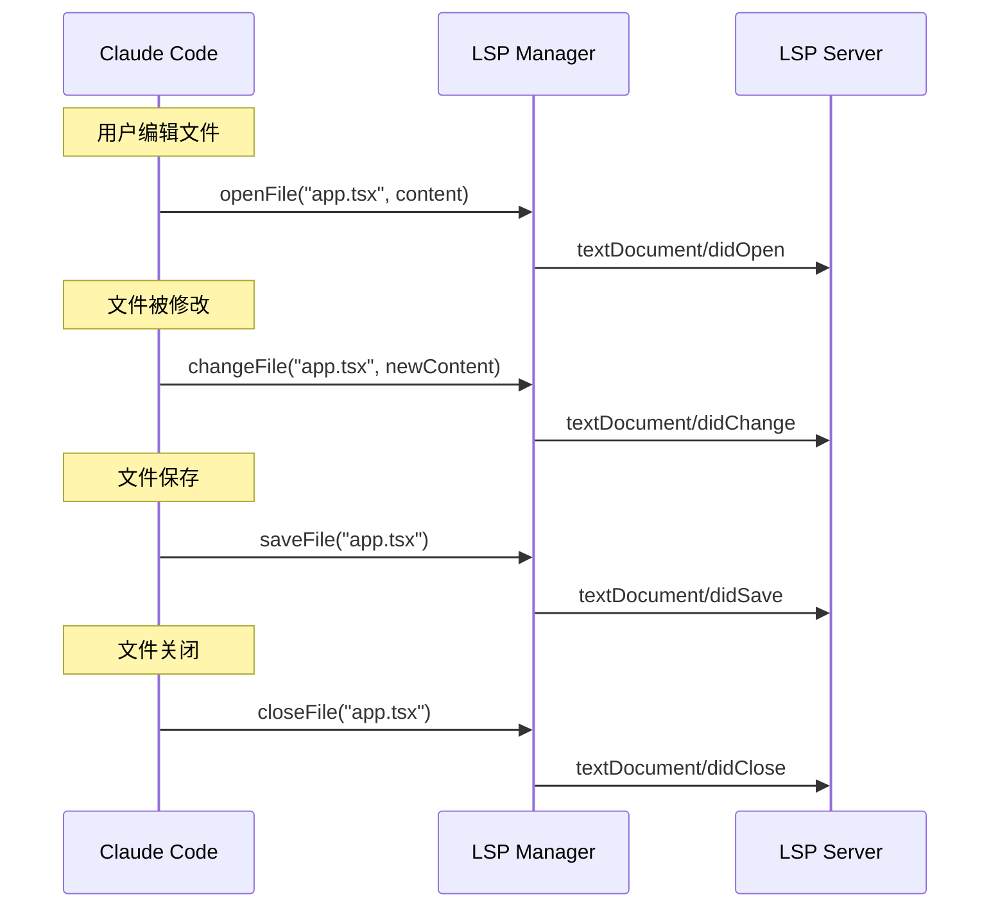

# 图解 Claude Code 完全指南 - 细纲

## 文件信息
- **原文件**: 06-lsp-integration.md
- **类型**: 第 6 课：LSP 语言服务器协议集成
- **难度**: ★★★☆☆

---

## 一、文档结构概览

### 1.1 学习目标
1. 理解 LSP（Language Server Protocol）的基本概念和在 Claude Code 中的角色
2. 掌握 `createLSPClient()` 的闭包模式状态管理
3. 学会 `LSPServerManager` 的多服务器路由机制
4. 了解文件生命周期通知（didOpen / didChange / didSave / didClose）

### 1.2 章节结构
| 章节 | 主题 | 核心内容 |
|------|------|---------|
| 一、"代码助教"的比喻 | 概念入门 | LSP 角色定位 |
| 二、LSP 客户端 | 核心实现 | createLSPClient 闭包模式 |
| 三、LSP 服务器管理器 | 管理模块 | LSPServerManager |
| 四、文件生命周期管理 | 协议实现 | didOpen/didChange/didSave/didClose |
| 五、LSP 配置来源 | 配置体系 | 插件系统配置 |
| 六、优雅关闭 | 生命周期 | shutdown → exit → kill |

---

## 二、关键知识点

### 2.1 LSP 角色定位
```
主讲老师（Claude）：理解意图，给出解决方案
助教（LSP）：检查拼写错误、告诉变量定义位置
```

LSP 能实时告诉你：
- 这行有语法错误 ❌
- 这个变量没被使用 ⚠️
- 这个函数定义在第 42 行 📍

### 2.2 LSP 客户端：createLSPClient()
```typescript
// services/lsp/LSPClient.ts
export function createLSPClient(
  serverName: string,
  onCrash?: (error: Error) => void,
): LSPClient {
  // 闭包内的私有状态
  let process: ChildProcess | undefined
  let connection: MessageConnection | undefined
  let capabilities: ServerCapabilities | undefined
  let isInitialized = false
  let isStopping = false

  // 延迟注册的处理器队列
  const pendingHandlers: Array<{
    method: string
    handler: (params: unknown) => void
  }> = []

  return {
    get capabilities() { return capabilities },
    get isInitialized() { return isInitialized },

    async start(command, args, options) { /* ... */ },
    async initialize(params) { /* ... */ },
    async sendRequest(method, params) { /* ... */ },
    async stop() { /* ... */ },
  }
}
```

**为什么用闭包而不是 class？**
- 状态完全私有，外部无法直接修改
- 无需 `this` 绑定问题
- 更容易进行单元测试

### 2.3 启动流程（5 步）


### 2.4 等待进程真正启动
```typescript
// spawn() 是异步的，ENOENT 等错误是异步触发的
// 必须等待 'spawn' 事件才能安全使用 stdio 流
await new Promise<void>((resolve, reject) => {
  spawnedProcess.once('spawn', resolve)
  spawnedProcess.once('error', reject)
})
```

### 2.5 崩溃检测与回调
```typescript
process.on('exit', (code) => {
  if (code !== 0 && code !== null && !isStopping) {
    isInitialized = false
    const crashError = new Error(
      `LSP server ${serverName} crashed with exit code ${code}`
    )
    onCrash?.(crashError)  // 通知所有者，触发重启
  }
})
```

### 2.6 LSPServerManager 职责
```typescript
// services/lsp/LSPServerManager.ts
export type LSPServerManager = {
  initialize(): Promise<void>        // 加载所有配置
  shutdown(): Promise<void>          // 关闭所有服务器
  getServerForFile(filePath: string) // 根据文件找服务器
  ensureServerStarted(filePath: string) // 确保服务器已启动
  sendRequest<T>(filePath, method, params) // 发送请求
  openFile(filePath, content): Promise<void>
  changeFile(filePath, content): Promise<void>
  saveFile(filePath): Promise<void>
  closeFile(filePath): Promise<void>
  isFileOpen(filePath): boolean
}
```

### 2.7 文件扩展名路由


```typescript
// 初始化时构建扩展名 → 服务器映射
for (const ext of Object.keys(config.extensionToLanguage)) {
  if (!extensionMap.has(ext.toLowerCase())) {
    extensionMap.set(ext.toLowerCase(), [])
  }
  extensionMap.get(ext)!.push(serverName)
}
```

### 2.8 按需启动
```typescript
async function ensureServerStarted(filePath: string) {
  const server = getServerForFile(filePath)
  if (!server) return undefined

  // 只有在 stopped 或 error 状态时才启动
  if (server.state === 'stopped' || server.state === 'error') {
    await server.start()
  }
  return server
}
```

### 2.9 文件生命周期管理


### 2.10 防重复打开
```typescript
async function openFile(filePath: string, content: string) {
  const fileUri = pathToFileURL(path.resolve(filePath)).href

  // 如果已在同一服务器上打开，跳过
  if (openedFiles.get(fileUri) === server.name) {
    return  // 避免重复 didOpen
  }

  // LSP 协议要求先 didOpen 再 didChange
  await server.sendNotification('textDocument/didOpen', {
    textDocument: {
      uri: fileUri,
      languageId: server.config.extensionToLanguage[ext] || 'plaintext',
      version: 1,
      text: content,
    },
  })
  openedFiles.set(fileUri, server.name)
}
```

### 2.11 LSP 配置来源
```typescript
// services/lsp/config.ts
export async function getAllLspServers(): Promise<{
  servers: Record<string, ScopedLspServerConfig>
}> {
  const { enabled: plugins } = await loadAllPluginsCacheOnly()

  // 并行加载所有插件的 LSP 服务器配置
  const results = await Promise.all(
    plugins.map(async plugin => {
      const scopedServers = await getPluginLspServers(plugin, errors)
      return { plugin, scopedServers, errors }
    }),
  )

  // 合并（后加载的插件覆盖先加载的同名服务器）
  for (const { scopedServers } of results) {
    if (scopedServers) {
      Object.assign(allServers, scopedServers)
    }
  }
  return { servers: allServers }
}
```

### 2.12 优雅关闭
```typescript
async stop(): Promise<void> {
  isStopping = true  // 标记正在关闭，防止错误日志

  try {
    // LSP 协议：先发 shutdown 请求
    await connection.sendRequest('shutdown', {})
    // 再发 exit 通知
    await connection.sendNotification('exit', {})
  } catch (error) {
    // 即使关闭失败也要继续清理
  } finally {
    // 清理 JSON-RPC 连接
    connection?.dispose()
    // 清理子进程
    process?.removeAllListeners()
    process?.kill()
    // 重置状态
    isInitialized = false
    capabilities = undefined
    isStopping = false
  }
}
```

---

## 三、关联文件索引

### 3.1 前置阅读
- [05-mcp-transport.md](05-mcp-transport.md) - MCP 传输方式

### 3.2 后续课程
- [07-oauth-authentication.md](07-oauth-authentication.md) - OAuth 认证

### 3.3 核心源码文件
| 文件路径 | 职责 | 行数 |
|---------|------|------|
| `services/lsp/LSPClient.ts` | LSP 客户端实现 | ~200 行 |
| `services/lsp/LSPServerManager.ts` | LSP 服务器管理器 | ~300 行 |
| `services/lsp/config.ts` | LSP 配置加载 | ~100 行 |

---

## 四、源码对应关系

### 4.1 核心类型
| 名称 | 类型 | 位置 | 说明 |
|------|------|------|------|
| `LSPClient` | interface | `services/lsp/LSPClient.ts` | LSP 客户端接口 |
| `LSPServerManager` | interface | `services/lsp/LSPServerManager.ts` | 服务器管理器接口 |

### 4.2 核心函数
| 函数名 | 位置 | 功能 |
|--------|------|------|
| `createLSPClient()` | `services/lsp/LSPClient.ts` | 创建 LSP 客户端 |
| `createLSPServerManager()` | `services/lsp/LSPServerManager.ts` | 创建服务器管理器 |
| `getAllLspServers()` | `services/lsp/config.ts` | 获取所有 LSP 服务器配置 |
| `ensureServerStarted()` | `services/lsp/LSPServerManager.ts` | 按需启动服务器 |
| `openFile()` | `services/lsp/LSPServerManager.ts` | 打开文件通知 |
| `changeFile()` | `services/lsp/LSPServerManager.ts` | 文件变更通知 |
| `closeFile()` | `services/lsp/LSPServerManager.ts` | 关闭文件通知 |

---

## 五、本课小结

| 概念 | 解释 |
|------|------|
| LSP | Language Server Protocol，提供代码级智能 |
| 闭包模式 | `createLSPClient()` 使用闭包管理私有状态 |
| 文件扩展名路由 | 根据文件扩展名分发到对应的 LSP 服务器 |
| 按需启动 | 服务器不在初始化时启动，而是按需启动 |
| 四种通知 | didOpen/didChange/didSave/didClose |
| 优雅关闭 | shutdown → exit → kill 顺序 |

---

*此细纲由 Claude Code 自动生成，用于快速导航和内容概览*
