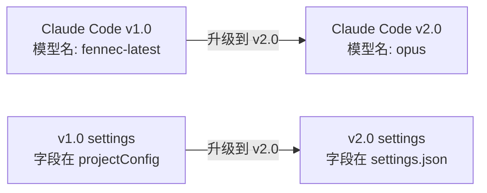
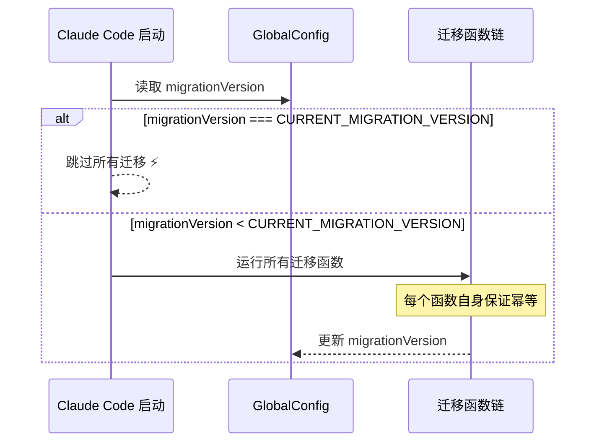

# 图解 Claude Code 完全指南 - 细纲

## 文件信息
- **原文件**: 08-migrations.md
- **类型**: 第 8 课：Migrations 版本迁移 —— 幂等函数链
- **难度**: ★★★☆☆

---

## 一、文档结构概览

### 1.1 学习目标
1. 理解为什么软件升级需要数据迁移
2. 掌握"幂等"的含义和为什么迁移函数必须幂等
3. 学会分析真实的迁移函数（模型别名、设置位置）
4. 了解迁移版本号和跳过优化机制
5. 认识迁移系统的容错设计

### 1.2 章节结构
| 章节 | 主题 | 核心内容 |
|------|------|---------|
| 一、为什么需要迁移？ | 概念入门 | 搬家整理类比 |
| 二、什么是幂等？ | 核心概念 | 定义、生活例子、必要性 |
| 三、迁移案例 1 | 模型别名 | migrateFennecToOpus |
| 四、迁移案例 2 | 设置位置 | migrateEnableAllProjectMcpServersToSettings |
| 五、迁移版本号机制 | 优化策略 | migrationVersion 跳过 |
| 六、迁移函数通用模式 | 设计模式 | 五步模板 |
| 七、Claude Code 迁移清单 | 全局视图 | 11 个迁移函数 |
| 八、与数据库迁移对比 | 横向对比 | Rails/Django vs Claude Code |

---

## 二、关键知识点

### 2.1 为什么需要迁移？


### 2.2 幂等的定义
> **幂等（Idempotent）**：一个操作执行一次和执行多次的结果是一样的。

**生活例子**：
| 操作 | 幂等？ | 说明 |
|------|--------|------|
| 关灯 | 是 | 关一次和关十次，灯都是灭的 |
| 存款 100 元 | 否 | 存一次是 100，存两次是 200 |
| 设置温度为 25°C | 是 | 设一次和设十次，温度都是 25°C |

### 2.3 迁移案例 1：模型别名迁移
```typescript
// 源码文件：migrations/migrateFennecToOpus.ts
export function migrateFennecToOpus(): void {
  // 只对内部用户生效
  if (process.env.USER_TYPE !== 'ant') {
    return
  }

  // 只读 userSettings（不读合并后的设置）
  const settings = getSettingsForSource('userSettings')
  const model = settings?.model

  if (typeof model === 'string') {
    if (model.startsWith('fennec-latest[1m]')) {
      updateSettingsForSource('userSettings', { model: 'opus[1m]' })
    } else if (model.startsWith('fennec-latest')) {
      updateSettingsForSource('userSettings', { model: 'opus' })
    } else if (
      model.startsWith('fennec-fast-latest') ||
      model.startsWith('opus-4-5-fast')
    ) {
      updateSettingsForSource('userSettings', {
        model: 'opus[1m]',
        fastMode: true,
      })
    }
  }
}
```

**幂等性分析**：
- 第一次运行：`fennec-latest` → `opus` ✅
- 第二次运行：`opus` → 不匹配任何条件 → 什么都不做 ✅

### 2.4 迁移案例 2：Sonnet 4.5 → 4.6
```typescript
// 源码文件：migrations/migrateSonnet45ToSonnet46.ts
export function migrateSonnet45ToSonnet46(): void {
  // 只对第一方用户生效
  if (getAPIProvider() !== 'firstParty') return

  // 只对付费用户生效
  if (!isProSubscriber() && !isMaxSubscriber() && !isTeamPremiumSubscriber()) return

  const model = getSettingsForSource('userSettings')?.model
  if (
    model !== 'claude-sonnet-4-5-20250929' &&
    model !== 'claude-sonnet-4-5-20250929[1m]' &&
    model !== 'sonnet-4-5-20250929' &&
    model !== 'sonnet-4-5-20250929[1m]'
  ) {
    return  // 不匹配任何旧别名 → 跳过
  }

  const has1m = model.endsWith('[1m]')
  updateSettingsForSource('userSettings', {
    model: has1m ? 'sonnet[1m]' : 'sonnet',
  })

  // 非新用户：记录迁移时间戳（用于显示通知）
  const config = getGlobalConfig()
  if (config.numStartups > 1) {
    saveGlobalConfig(current => ({
      ...current,
      sonnet45To46MigrationTimestamp: Date.now(),
    }))
  }
}
```

**多重守卫条件**：
1. 第一方用户？
2. 付费用户？
3. 模型是旧 Sonnet 4.5？
4. 非新用户？记录时间戳

### 2.5 迁移案例 3：设置位置迁移
```typescript
// 源码文件：migrations/migrateEnableAllProjectMcpServersToSettings.ts
export function migrateEnableAllProjectMcpServersToSettings(): void {
  const projectConfig = getCurrentProjectConfig()

  // 检查需要迁移的字段
  const hasEnableAll = projectConfig.enableAllProjectMcpServers !== undefined
  const hasEnabledServers = projectConfig.enabledMcpjsonServers?.length > 0
  const hasDisabledServers = projectConfig.disabledMcpjsonServers?.length > 0

  // 没有需要迁移的字段 → 直接返回（幂等！）
  if (!hasEnableAll && !hasEnabledServers && !hasDisabledServers) {
    return
  }

  try {
    const existingSettings = getSettingsForSource('localSettings') || {}
    const updates = {}

    // 迁移 enableAllProjectMcpServers
    if (hasEnableAll && existingSettings.enableAllProjectMcpServers === undefined) {
      updates.enableAllProjectMcpServers = projectConfig.enableAllProjectMcpServers
    }

    // 迁移 enabledMcpjsonServers（合并，去重）
    if (hasEnabledServers) {
      updates.enabledMcpjsonServers = [
        ...new Set([
          ...(existingSettings.enabledMcpjsonServers || []),
          ...projectConfig.enabledMcpjsonServers,
        ]),
      ]
    }

    // 写入新位置
    if (Object.keys(updates).length > 0) {
      updateSettingsForSource('localSettings', updates)
    }

    // 从旧位置删除
    saveCurrentProjectConfig(current => {
      const { enableAllProjectMcpServers, enabledMcpjsonServers,
              disabledMcpjsonServers, ...rest } = current
      return rest
    })
  } catch (e) {
    logError(e)  // 迁移失败不影响启动
  }
}
```

**迁移三步曲**：
1. 检查旧位置有数据？
2. 写入新位置（合并去重）
3. 清理旧位置（删除已迁移字段）

### 2.6 迁移版本号机制
```typescript
// 源码文件：utils/config.ts
// Version of the last-applied migration set. When equal to
// CURRENT_MIGRATION_VERSION, runMigrations() skips all sync migrations
// (avoiding 11× saveGlobalConfig lock+re-read on every startup).
migrationVersion?: number
```



### 2.7 迁移函数通用模板
```typescript
// 迁移函数模板
export function migrateXxxToYyy(): void {
  // 1️⃣ 前置条件检查（提前返回）
  if (!shouldRun()) return

  // 2️⃣ 读取当前状态
  const currentValue = readCurrentState()

  // 3️⃣ 判断是否需要迁移
  if (isAlreadyMigrated(currentValue)) return

  // 4️⃣ 执行迁移
  try {
    writeNewState(transform(currentValue))
    cleanupOldState()
  } catch (e) {
    // 5️⃣ 容错：记录错误但不中断启动
    logError(e)
  }
}
```

### 2.8 容错设计
```typescript
// 源码中每个迁移函数都有类似的 try/catch
try {
  // 迁移逻辑
} catch (e: unknown) {
  logError(e)
  logEvent('tengu_migrate_xxx_error', {})
  // 不 throw！迁移失败不应该阻止用户使用
}
```

### 2.9 Claude Code 迁移清单（11 个）
| 迁移 | 作用 |
|------|------|
| `migrateFennecToOpus` | 模型别名：fennec → opus |
| `migrateSonnet45ToSonnet46` | 模型别名：sonnet-4.5 → sonnet |
| `migrateSonnet1mToSonnet45` | 模型别名：sonnet[1m] → sonnet-4.5 |
| `migrateOpusToOpus1m` | 模型别名：opus → opus[1m] |
| `migrateLegacyOpusToCurrent` | 旧版 opus 别名更新 |
| `resetProToOpusDefault` | 重置 Pro 用户的默认模型 |
| `resetAutoModeOptInForDefaultOffer` | 重置自动模式选择 |
| `migrateEnableAllProjectMcpServersToSettings` | MCP 审批字段位置迁移 |
| `migrateBypassPermissionsAcceptedToSettings` | 权限绕过字段迁移 |
| `migrateAutoUpdatesToSettings` | 自动更新设置迁移 |
| `migrateReplBridgeEnabledToRemoteControlAtStartup` | Bridge 启动设置迁移 |

---

## 三、关联文件索引

### 3.1 前置阅读
- [07-history.md](07-history.md) - History 会话历史

### 3.2 后续课程
- [09-persistence-strategy.md](09-persistence-strategy.md) - 持久化策略

### 3.3 核心源码文件
| 文件路径 | 职责 | 行数 |
|---------|------|------|
| `migrations/migrateFennecToOpus.ts` | fennec → opus 迁移 | ~30 行 |
| `migrations/migrateSonnet45ToSonnet46.ts` | sonnet45 → sonnet46 迁移 | ~40 行 |
| `migrations/migrateEnableAllProjectMcpServersToSettings.ts` | MCP 设置迁移 | ~60 行 |
| `utils/config.ts` | migrationVersion 定义 | - |

---

## 四、源码对应关系

### 4.1 核心函数
| 函数名 | 位置 | 功能 |
|--------|------|------|
| `migrateFennecToOpus()` | `migrations/migrateFennecToOpus.ts` | fennec 模型别名迁移 |
| `migrateSonnet45ToSonnet46()` | `migrations/migrateSonnet45ToSonnet46.ts` | sonnet 模型升级 |
| `migrateEnableAllProjectMcpServersToSettings()` | `migrations/migrateEnableAllProjectMcpServersToSettings.ts` | MCP 设置位置迁移 |
| `getSettingsForSource()` | 外部 | 获取指定源设置 |
| `updateSettingsForSource()` | 外部 | 更新指定源设置 |
| `getGlobalConfig()` | 外部 | 获取全局配置 |
| `saveGlobalConfig()` | 外部 | 保存全局配置 |

### 4.2 关键常量
| 常量名 | 值 | 说明 |
|--------|-----|------|
| `CURRENT_MIGRATION_VERSION` | number | 当前迁移版本号 |
| `migrationVersion` | config 字段 | 上次应用的迁移版本 |

---

## 五、本课小结

| 概念 | 解释 |
|------|------|
| 数据迁移 | 软件升级时将旧格式数据转换为新格式 |
| 幂等性 | 执行一次和执行多次结果相同 |
| 前置守卫 | 迁移函数开头的 `if (!condition) return` 保证幂等 |
| 版本号跳过 | `migrationVersion` 避免每次启动都运行迁移 |
| 容错优先 | 迁移失败不阻塞启动，记录错误继续运行 |
| 迁移三步曲 | 读旧值 → 写新位置 → 清理旧位置 |
| 源级隔离 | 只读写 `userSettings`，不碰 `projectSettings` |

---

*此细纲由 Claude Code 自动生成，用于快速导航和内容概览*
