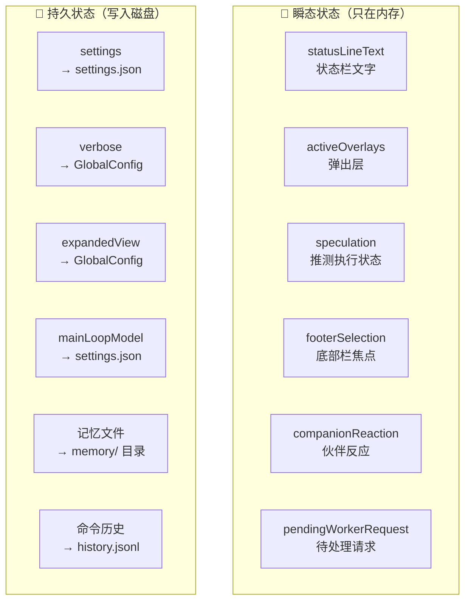
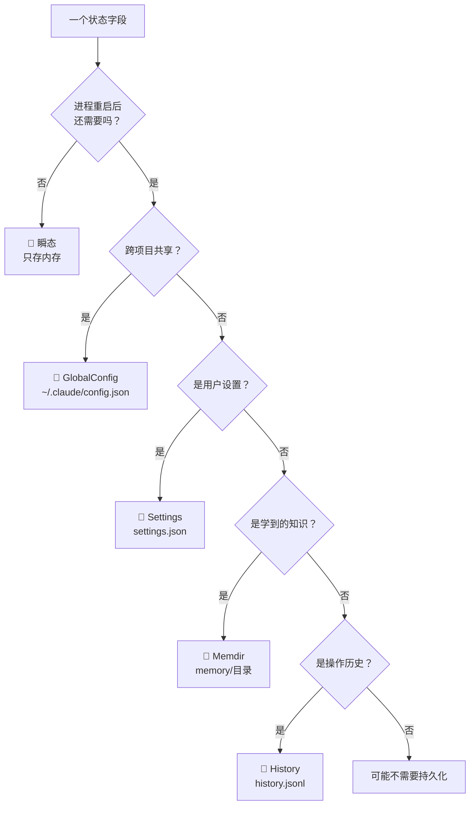
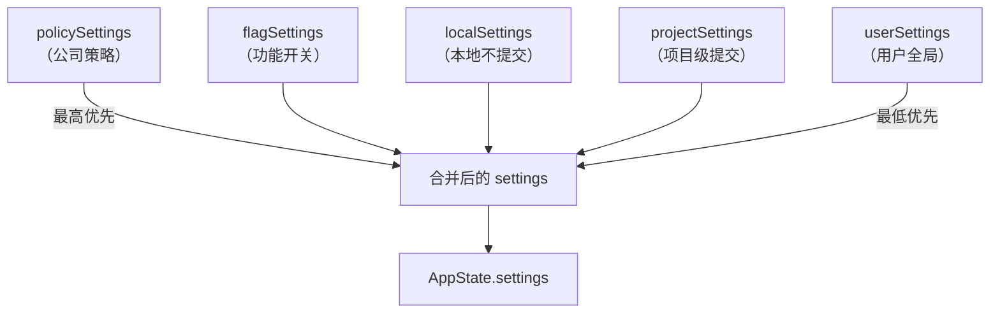

# 图解 Claude Code 完全指南 - 细纲

## 文件信息
- **原文件**: 09-persistence-strategy.md
- **类型**: 第 9 课：持久化策略 —— 何时写盘、何时只存内存
- **难度**: ★★★☆☆

---

## 一、文档结构概览

### 1.1 学习目标
1. 理解瞬态状态 vs 持久状态的划分标准
2. 掌握三种写入时机（立即 / 延迟 / 退出前）的适用场景
3. 学会分析不同存储位置的选型逻辑
4. 了解 Claude Code 中"不持久化"的设计智慧
5. 认识安全和性能对持久化策略的影响

### 1.2 章节结构
| 章节 | 主题 | 核心内容 |
|------|------|---------|
| 一、不是所有状态都需要持久化 | 概念入门 | 瞬态 vs 持久态对比 |
| 二、划分标准 | 决策树 | 五问判断法 |
| 三、三种写入时机 | 核心知识 | 立即/延迟/退出前 |
| 四、存储位置详解 | 四种位置 | GlobalConfig/Settings/Memdir/History |
| 五、不持久化的设计智慧 | 反向思考 | 故意不持久化的状态 |
| 六、安全与权限 | 安全考量 | 0o600 权限、源级隔离 |
| 七、持久化策略全景 | 全局视图 | 决策图 |
| 八、性能与可靠性平衡 | 权衡分析 | 四种策略对比 |

---

## 二、关键知识点

### 2.1 瞬态 vs 持久态


### 2.2 持久化决策树


### 2.3 五问判断法
| 问题 | 答案为"是"则 |
|------|-------------|
| 1. 进程重启后需要恢复吗？ | 需要持久化 |
| 2. 需要跨项目共享吗？ | 存 GlobalConfig |
| 3. 用户可能想手动编辑吗？ | 存人类可读格式（JSON/MD） |
| 4. 变化频率很高吗？ | 延迟写入或不持久化 |
| 5. 包含敏感信息吗？ | 注意权限（`0o600`） |

### 2.4 三种写入时机

#### 立即写入（Immediate）
```typescript
// 来自 onChangeAppState.ts：模型设置变更立即保存
if (newState.mainLoopModel !== oldState.mainLoopModel) {
  updateSettingsForSource('userSettings', { model: newState.mainLoopModel })
}
```

#### 延迟写入（Deferred / Buffered）
```typescript
// 来自 history.ts：命令历史用缓冲区延迟写入
pendingEntries.push(logEntry)
currentFlushPromise = flushPromptHistory(0)  // 异步刷盘

async function flushPromptHistory(retries: number): Promise<void> {
  if (isWriting || pendingEntries.length === 0) return
  // 批量写入所有待处理条目
  await immediateFlushHistory()
  if (pendingEntries.length > 0) {
    await sleep(500)  // 等 500ms 再尝试
    void flushPromptHistory(retries + 1)
  }
}
```

#### 退出前写入（On-exit）
```typescript
// 来自 history.ts：注册退出清理
registerCleanup(async () => {
  if (currentFlushPromise) {
    await currentFlushPromise  // 等待进行中的写入
  }
  if (pendingEntries.length > 0) {
    await immediateFlushHistory()  // 最终刷盘
  }
})
```

### 2.5 四种存储位置详解

#### GlobalConfig（全局配置）
```
位置：~/.claude/config.json
范围：跨项目共享
格式：JSON
```

```typescript
// 部分字段示例（来自 utils/config.ts）
{
  numStartups: 42,          // 启动次数
  verbose: false,           // 详细模式
  theme: 'dark',            // 主题
  showExpandedTodos: true,  // 展开任务面板
  showSpinnerTree: false,   // 展开队友面板
  tungstenPanelVisible: true, // tmux 面板可见
  migrationVersion: 11,     // 迁移版本
}
```

#### Settings（用户设置）
```
位置：多层合并
  - ~/.claude/settings.json      (userSettings)
  - .claude/settings.local.json  (localSettings)
  - .claude/settings.json        (projectSettings)
范围：可以是全局或项目级
格式：JSON
```

**多源合并优先级**：


#### Memory 目录（记忆）
```
位置：~/.claude/projects/{sanitized-path}/memory/
范围：项目级（git worktree 共享）
格式：Markdown with YAML frontmatter
```

#### History 文件（历史）
```
位置：~/.claude/history.jsonl
范围：全局（但按项目过滤读取）
格式：JSONL（每行一条 JSON）
```

### 2.6 故意不持久化的状态

#### 推测执行状态
```typescript
// AppState 中的 speculation 字段
speculation: SpeculationState  // idle 或 active
speculationSessionTimeSavedMs: number
```
**为什么不持久化？** 推测执行是一个运行时优化——进程重启后，旧的推测结果已经没有意义了。

#### Bridge 连接状态
```typescript
replBridgeConnected: boolean      // WebSocket 是否连接
replBridgeSessionActive: boolean  // 会话是否活跃
replBridgeReconnecting: boolean   // 是否正在重连
```
**为什么不持久化？** 网络连接状态本质是瞬态的——重启后需要重新建立连接。

#### UI 焦点状态
```typescript
footerSelection: FooterItem | null
activeOverlays: ReadonlySet<string>
coordinatorTaskIndex: number
```
**为什么不持久化？** UI 焦点在用户重新打开程序时应该从默认位置开始。

### 2.7 安全与权限

#### 文件权限
```typescript
// history.ts 中写文件时的权限设置
await writeFile(historyPath, '', { mode: 0o600, ... })
await appendFile(historyPath, jsonLines.join(''), { mode: 0o600 })
```
`0o600` = 仅文件所有者可读写（rw-------）

#### 记忆目录安全
```typescript
// memdir/paths.ts：projectSettings 不能覆盖记忆目录
// SECURITY: projectSettings (.claude/settings.json committed to the repo) is
// intentionally excluded — a malicious repo could otherwise set
// autoMemoryDirectory: "~/.ssh" and gain silent write access
```

### 2.8 性能与可靠性平衡
| 策略 | 数据安全性 | 性能影响 | 适用场景 |
|------|-----------|---------|---------|
| 每次变更立即写 | ⭐⭐⭐⭐⭐ | ⭐（最慢） | 关键设置 |
| 缓冲+定期刷盘 | ⭐⭐⭐⭐ | ⭐⭐⭐（中等） | 高频操作 |
| 仅退出前写 | ⭐⭐⭐ | ⭐⭐⭐⭐⭐（最快） | 可重建数据 |
| 不持久化 | ⭐ | ⭐⭐⭐⭐⭐（零开销） | 纯瞬态数据 |

---

## 三、关联文件索引

### 3.1 前置阅读
- [08-migrations.md](08-migrations.md) - Migrations 版本迁移

### 3.2 后续课程
- [10-architecture-overview.md](10-architecture-overview.md) - 架构全景

### 3.3 核心源码文件
| 文件路径 | 职责 | 行数 |
|---------|------|------|
| `state/onChangeAppState.ts` | 副作用收口（决定何时写盘） | 172 行 |
| `utils/config.ts` | GlobalConfig 定义 | - |
| `history.ts` | 延迟写入实现 | 465 行 |
| `memdir/paths.ts` | 记忆路径安全验证 | 279 行 |

---

## 四、源码对应关系

### 4.1 核心函数
| 函数名 | 位置 | 功能 |
|--------|------|------|
| `saveGlobalConfig()` | `utils/config.ts` | 保存全局配置 |
| `getGlobalConfig()` | `utils/config.ts` | 获取全局配置 |
| `updateSettingsForSource()` | 外部 | 更新指定源设置 |
| `getSettingsForSource()` | 外部 | 获取指定源设置 |
| `registerCleanup()` | 外部 | 注册退出清理回调 |

### 4.2 关键常量
| 常量名 | 值 | 说明 |
|--------|-----|------|
| `0o600` | 文件权限 | 仅所有者可读写 |

---

## 五、本课小结

| 概念 | 解释 |
|------|------|
| 瞬态状态 | 只存内存，进程结束就消失（UI 焦点、连接状态） |
| 持久状态 | 写入磁盘，跨会话保留（设置、记忆、历史） |
| 立即写入 | 状态变化时立刻写盘（关键设置） |
| 延迟写入 | 先缓冲再批量写盘（高频操作） |
| 退出保底 | `registerCleanup` 确保缓冲数据不丢 |
| 存储选型 | GlobalConfig（跨项目）/ Settings（可配置）/ Memory（知识）/ History（历史） |
| 安全考量 | 文件权限 `0o600`、源级隔离、路径验证 |

---

*此细纲由 Claude Code 自动生成，用于快速导航和内容概览*
